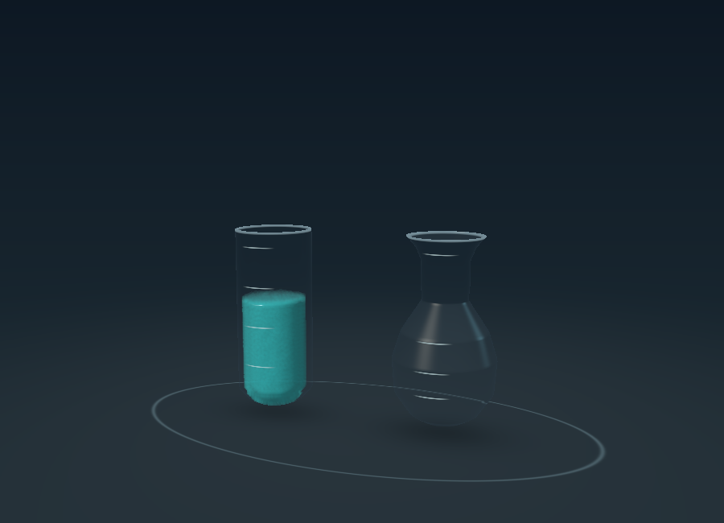
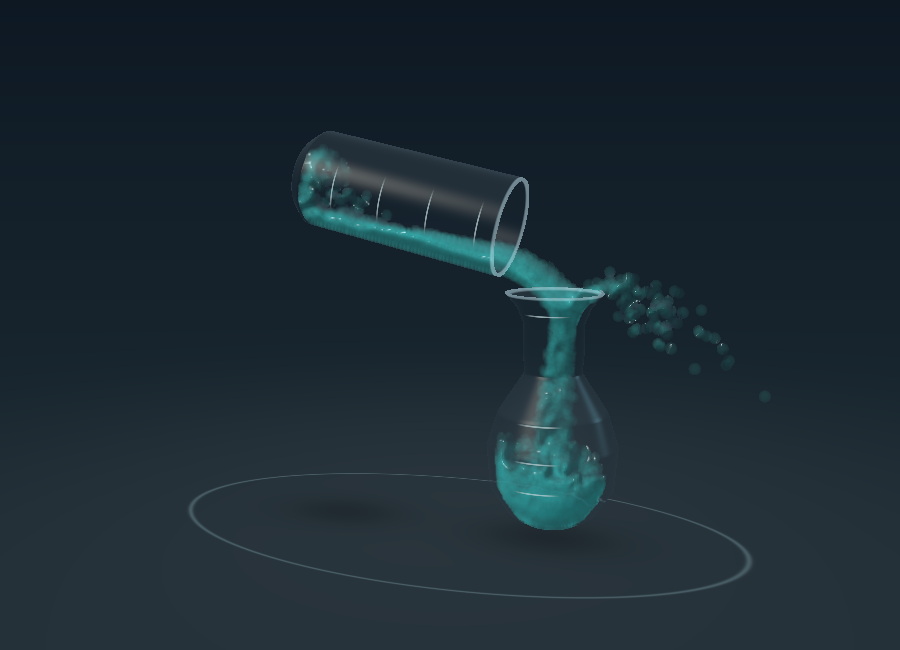
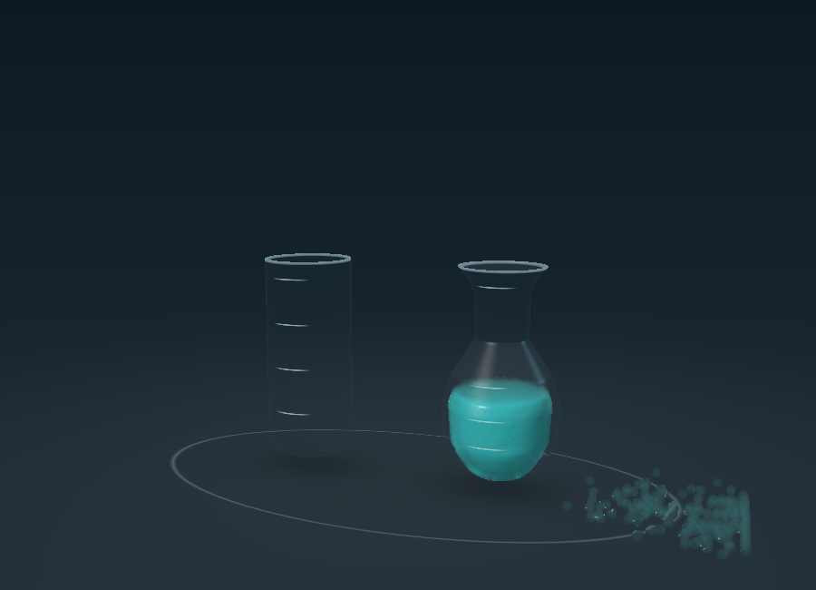
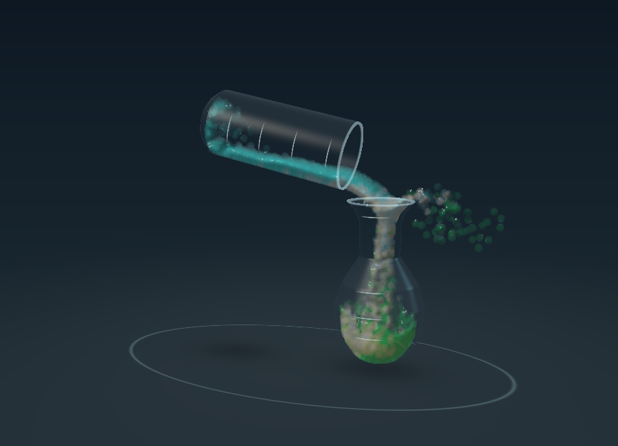

# Fluid Lab prototype 01 — review notes

September 7, 2026. Native Swift + Metal. No Unity or third-party runtime dependencies.

**Try it**

Open `Vials Fluid Lab.xcodeproj`, select the **Vials Fluid Lab** scheme and **My Mac**, then Run. The app opens directly in the new lab. The existing sorting game is available with **Classic**.

1. Press **Pour liquid**. The source lifts, moves over the flask, tilts, pours, returns, and settles. This deliberately slow study takes roughly 19 seconds including settling. Press Reset before another pour.
2. Try **Thick** to increase velocity smoothing, or **Two dyes** to see colored parcels advect through the flow. Changing the preset resets the scene.
3. Use Pause to inspect a moment. Reset works during a pour and restores the original three units.
4. The sliders icon opens diagnostics: particle view, camera angle, GPU timing, in-flight count, and tray count. Orbit works while paused. Pausing stops repeated GPU submissions once the still frame is drawn.

If Run reports signing issues on an iPhone or iPad, configure normal development signing for this app's separate identifier. The project has passed unsigned iOS compilation; device installation has not been tested.

**What is implemented**

- Two actual 3D hollow vessels: a rounded vial and a bulb flask with a flared opening and narrower throat. The wider mouth guides the stream through geometry and collision forces; no particles are teleported into the receiver.
- Both vessels have four units of calibrated usable capacity, with headspace. The source starts with three units. Volume graduations are unevenly spaced on the flask because its cross-sectional area varies.
- One interior radius profile drives the volume integral, glass meshes, graduations, and liquid collision boundary. Volume integration is exact within each piecewise-linear radius segment; height inversion uses binary search.
- 3,183 fluid particles with a fixed 1/120-second timestep, spatial neighbor grid, three position-based pressure iterations per substep, gravity, collision projection against moving vessels, and XSPH-style neighbor-velocity smoothing.
- A preplanned vessel trajectory. Detailed liquid motion and travel to the destination come from the solver. Spills remain on the tray and are counted; the receiving volume is not artificially reconciled to the expected amount.
- GPU particle-depth and optical-thickness passes, bilateral surface smoothing, reconstructed normals, absorption shading, procedural reflections, and approximate screen-space glass refraction. A diagnostic mode exposes the underlying particles.
- Existing Classic game source and assets are preserved. Its puzzle solver does not depend on this experiment's continuous simulation.

The fluid solver follows the constraint-based approach described in [Position Based Fluids](https://mmacklin.com/pbf_sig_preprint.pdf), with a deliberately limited prototype implementation. It does not implement the full paper, calibrated surface tension, or a multiphase pressure model.

**Measured results**

Offscreen runs on **Apple M4**, using the same simulation and rendering path as the app, with 3,183 particles. Each standard run covers 21 simulated seconds. These are GPU command execution timings, not end-to-end app frame times or mobile performance claims. The portrait run advances four physics substeps per rendered frame instead of the usual two, hence its larger per-frame GPU time.

| Test | Render size | GPU median | GPU p95 | In flask after settling | On tray |
|---|---|---:|---:|---:|---:|
| Water | 900 × 650 | 2.30 ms | 2.72 ms | 95.73% | 4.27% |
| Thick | 900 × 650 | 2.26 ms | 2.31 ms | 97.68% | 2.32% |
| Two dyes | 900 × 650 | 2.31 ms | 2.74 ms | 95.79% | 4.21% |
| Portrait / 30 fps | 430 × 520 | 4.09 ms | 4.55 ms | 95.92% | 4.08% |

Minor run-to-run variation is expected from parallel floating-point particle calculations. The retained JSON reports contain samples, device information, and measured stream crossings at the mouth.

Checks passed:

- Cylinder and cone analytic-volume checks, 101 volume-to-height round trips per vessel, and matching usable capacities.
- Vessel clearance sampled across the complete motion path.
- Particle inventory and finite positions throughout all four runs. The starting fill remains in the source before pouring.
- At least 90% capture in the receiving vessel. This is an experimental acceptance gate; it is far below the eventual spill-free Classic target.
- Pause preserves particle positions, completed-pour reset restores the source, and water tests also reset during an active pour.
- A portrait viewport at 30 render updates per simulated second, including a pour requested immediately after initialization.
- Unsigned Debug builds for macOS and iOS with Xcode 27.0 (27A5237l).

**Live macOS checks completed September 8, 2026**, after the Mac was unlocked, using the prototype build from commit `8b21274`:

- Water pour advanced through the animated sequence to **Pour complete**. The live display reported 0.00 units in the source, 2.87 units in the receiver, 134 particles on the tray, and none in flight, consistent with the offscreen spill measurements.
- Pause/resume worked after a pour and during an active Thick pour. Reset during that interrupted pour restored 3.00 source units, an empty receiver, zero tray particles, and the enabled Pour button.
- Water, Thick, and Two dyes selection updated the selected preset and reset the experiment. The Two dyes explanatory text appeared correctly.
- Particle diagnostics and camera orbit responded while paused. Normal and zoomed window sizes kept the experiment and controls available.
- Classic opened during a Two dyes pour. Returning to Fluid Lab resumed the sequence from the lifting phase; the subsequent live reading reached settling with 2.87 receiver units. This also exercised pausing while the Classic sheet was open.
- The app was left open on a reset, paused Water scene, with diagnostics closed. **Pour liquid** resumes it directly.

No application-code changes were needed from these checks. The UI automation supplied low-resolution screenshots, so these checks establish interactive behavior and broad rendering/layout, not a pixel-level visual-quality review. The images below remain actual offscreen renderer captures. iPhone/iPad runtime, touch interaction, sustained thermal behavior, and visionOS presentation still need verification.

**Known limits and next work**

The main remaining behavior issue is splashing: roughly 2–4% of the liquid currently ends on the tray. This is an honest physical outcome of the current solver and pouring path, not acceptable final behavior for a precise sorting move. The next experiment should improve receiving-wall collision response and flow control before adding exact one-unit metering.

Surface reconstruction can still look granular during fast flow. The glass uses approximate refraction rather than physically correct nested refractive interfaces. Its rim is modeled, but the glass base and wetting behavior need more work. Optical thickness comes from particle splats, so the apparent fill is not a certified geometric-volume measurement during motion.

The **Thick** preset changes neighbor-velocity smoothing; it is not a measured viscosity or a honey simulation. **Two dyes** preserves a color tag per particle: it demonstrates advection and visual blending, not chemical reactions, density separation, or molecular diffusion. Arbitrary layer order is not preserved during these pours.

This is a standalone investigation. It does not yet transfer a selected number of units from the Classic game, guarantee spill-free moves, implement density/mixing puzzle rules, or optimize idle simulation for battery use. Material constants use scene units and are tuned for visual experimentation rather than calibrated SI measurements.

**Reproduce the checks**

Run from the project directory on a Mac with Xcode and Metal support:

```sh
bash Scripts/validate_fluid_lab.sh
```

The script writes an isolated build, JSON reports, and PNG captures to a new temporary directory. Pass a destination directory as its first argument if desired. It uses Xcode's installed Metal toolchain and does not install packages or alter app signing.

**Actual render captures**

Ready:



During the simulated pour:



Settled, including liquid on the tray:



Two passive dyes:


