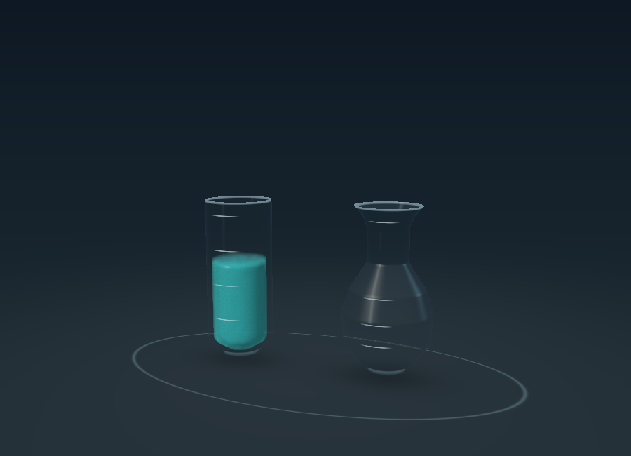
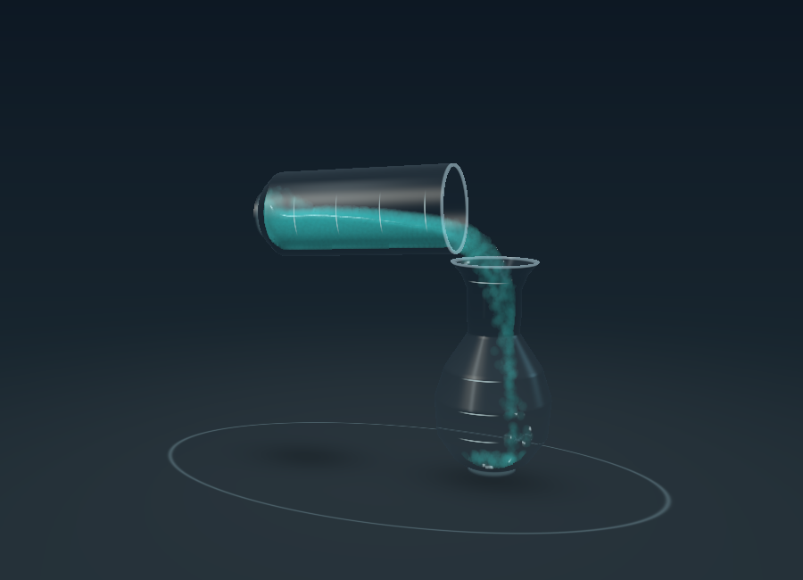
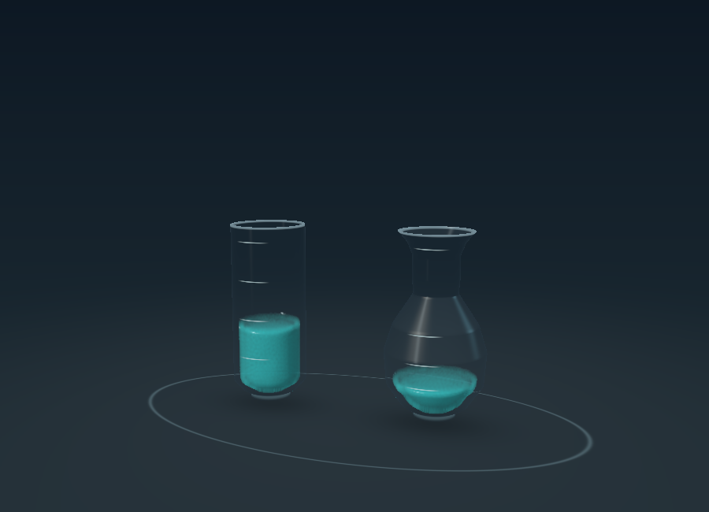
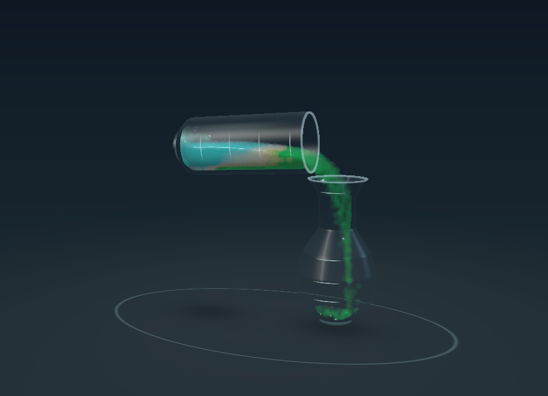

# Fluid Lab prototype 02 — measured pouring and bounded cleanup

September 8, 2026. Native Swift + Metal. Independent Fluid Lab copy; no Unity.

## Try it

Run **Vials Fluid Lab** from `Vials Fluid Lab.xcodeproj` on My Mac. Choose **Pour one unit**. After the lift, pour, cutoff, return, and final settling, the source holds two units and the flask one. Reset before another pour. The complete sequence takes about 13.5–13.7 simulated seconds once the initial fill is settled, down from roughly 19 seconds in prototype 01.

The sliders button opens diagnostics, including **Slow motion** (35% speed), particle view, camera orbit, physical transfer before cleanup, and the number of particles corrected. Pause preserves the pose; Reset and material selection restore the initial three-unit fill. Classic still opens the original sorting game.

## What changed

- Adaptive metering measures liquid that has left the source, including the stream still in flight. Tilt increases more slowly once fluid begins flowing, and cutoff anticipates the remaining stream.
- The cutoff first holds the mouth over the receiver, then rotates around the source base and returns to the tray. This avoids throwing the remaining liquid out of a partly filled source.
- Wall contact accounts for the vessel's motion and local wall slope, with inelastic contact response. This reduces artificial bounce and splash-back.
- Glass has a solid base and underside, a thickness-dependent refraction offset, and a broader studio reflection. The liquid depth surface uses a wider bilateral smoothing kernel.
- The completed pour and an untouched fill after four simulated seconds stop advancing physics. The live view also suppresses repeated GPU frames while resting or paused, while allowing camera/particle-view/resize redraws.
- Puzzle quantities use an integer ledger, independent of floating-point particle motion. It commits once, only after the physical pour and final correction pass their checks. This ledger is local to the lab; Classic has not been migrated.

## The 5% cleanup contract

The user approved a small final presentation correction. After the physical pour has returned and settled, both the source's loss and the receiver's gain must be within **5% of one unit**, and the total particles requiring relocation must also fit that allowance. This is not 5% of the entire three-unit starting fill.

A passing pour relocates only surplus particles to the vessel with a deficit. Particle count, per-particle volume, and dye tags are conserved. Adjusted particle surfaces fade in over 0.3 simulated seconds and relax under the solver for 0.8 seconds. Then the quantities must be exactly **2,122 source particles and 1,061 receiver particles**, with no particles outside, before the ledger commits two source units and one destination unit.

The correction is explicitly a visual/gameplay convenience, not physical fluid transport. Larger misses receive no correction and are marked **Pour needs adjustment**. There is no unbounded rescue or silent acceptance. Diagnostics and the reports preserve the pre-correction result so the cleanup cannot hide a deteriorating solver.

## Results

All 14 final offscreen cases passed their expected outcomes on Apple M4, using the same renderer and controller as the app. The nine standard pours had **zero spills before cleanup**, as did the portrait, slow-motion, and deliberately larger-correction cases. They retained all 3,183 particles and all dye tags. Sampled vessel surfaces did not intersect along accepted adaptive trajectories.

| Case | Physical units before cleanup | Particles corrected | Final receiver units | Outcome |
|---|---:|---:|---:|---|
| 1-dyes | 1.0057 | 6 | 1.0000 | Accepted |
| 1-thick | 0.9821 | 19 | 1.0000 | Accepted |
| 1-water | 0.9943 | 6 | 1.0000 | Accepted |
| 2-dyes | 1.0085 | 9 | 1.0000 | Accepted |
| 2-thick | 0.9830 | 18 | 1.0000 | Accepted |
| 2-water | 1.0000 | 0 | 1.0000 | Accepted |
| 3-dyes | 1.0094 | 10 | 1.0000 | Accepted |
| 3-thick | 0.9802 | 21 | 1.0000 | Accepted |
| 3-water | 1.0009 | 1 | 1.0000 | Accepted |
| portrait | 1.0189 | 20 | 1.0000 | Accepted |
| slow | 1.0047 | 5 | 1.0000 | Accepted |
| large | 1.0443 | 47 | 1.0000 | Accepted |
| rejected-volume | 1.0858 | 0 | 1.0858 | Rejected |
| rejected-aim | 0.0000 | 0 | 0.0000 | Rejected |

The deliberate 1.0443-unit over-pour was corrected within the allowance. The 1.0858-unit over-pour was rejected without correction. A deliberately misaligned stream also failed and was left uncorrected. These are regression fixtures, not user-selectable materials.

Each standard test ran at 900 × 650 with 60 render updates per simulated second. The portrait test used 430 × 520 at 30 fps and requested pouring immediately on initialization. Slow motion ran at 35% speed. Parallel GPU calculations produce small run-to-run variation; the exact corrected result is deterministic.

Additional checks cover analytical cylinder/cone volumes, 101 volume/height round trips per vessel, equal usable capacities, finite particle state, count and dye conservation throughout the run, reset during a transfer, paused/resting state, and prevention of a second ledger commit.

GPU timings and bounded encode-plus-GPU-wait timings are retained in each JSON. These offscreen measurements exclude UI composition and do not establish phone frame rate, battery usage, or sustained thermal performance. The controller currently waits for the preceding GPU command and reads particle counts once per rendered transfer frame; moving feedback onto the GPU remains a performance option.

## Build and live checks

- Final cleanup-enabled unsigned Debug macOS and iOS builds passed with Xcode 27.0 (27A5237l). The only build warning was Xcode's App Intents metadata notice because this app has no App Intents dependency.
- Before adding the user-approved cleanup, the live second prototype completed a one-unit transfer with 1.003 physical units, no spills, and the expected 2.00/1.00 ledger display. Slow motion, two dyes, pause, camera, particle view, and Classic return were exercised.
- The Mac locked again when restarting for the final cleanup-enabled live check. That last interactive check remains pending; the final correction has been validated offscreen. UI automation also provides low-resolution screenshots, so full-resolution visual review uses the actual renderer captures below.
- Paired iPhone and iPad hardware was reported offline by Xcode. The unsigned iOS build is not a device runtime or thermal test.

## Scope and next investigation

This milestone covers a three-unit starting fill, one-unit transfer, the rounded source and bulb receiver, and the three existing presets. It does not yet support repeated arbitrary moves, other starting fills, partially full receivers, alternate shape families, or preservation of Classic layer order. The correction tolerance makes those future experiments practical, but each configuration still needs its own measured checks.

Next, verify the final interactive build and target-device performance. Then expand the metering fixtures to other fills and shapes before connecting the lab presentation to Classic's move/undo logic. Keep the 5% contract and exact final quantities as regression gates.

After that, use separate puzzle experiments for (1) viscosity-dependent timing and narrow-neck transfers, (2) immiscible fluids with density-driven reordering, and (3) explicit mixing recipes such as blue + red → purple. These require new material/rule models. The current Thick preset is velocity smoothing, and Two dyes is passive advection; neither is calibrated viscosity, density separation, or a chemical simulation.

Remaining visual work includes finer stream reconstruction, wetting/meniscus behavior, and more accurate nested glass/liquid optics. The current surface can still look particulate during fast flow. Lighting and refraction remain deliberately approximate.

## Reproduce

```sh
bash Scripts/validate_fluid_lab.sh
```

The script builds into a temporary directory and runs nine standard repeats, portrait/reset, slow motion, a larger accepted correction, and two rejection fixtures. It saves logs, JSON, and actual render captures without altering signing or installing packages. The constituent final checks were run during development; no physical-device test is implied.

## Actual renderer captures

Ready:



Measured stream:



After correction and settling:



Two passive dyes:


