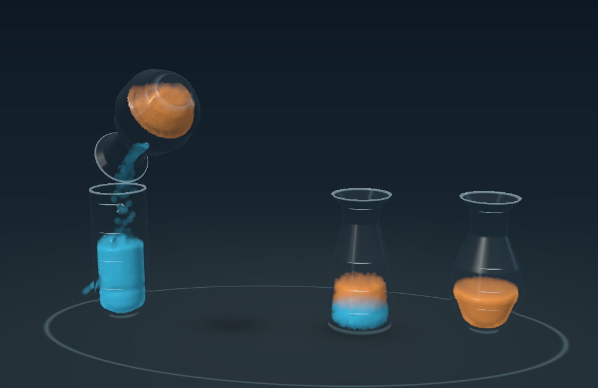
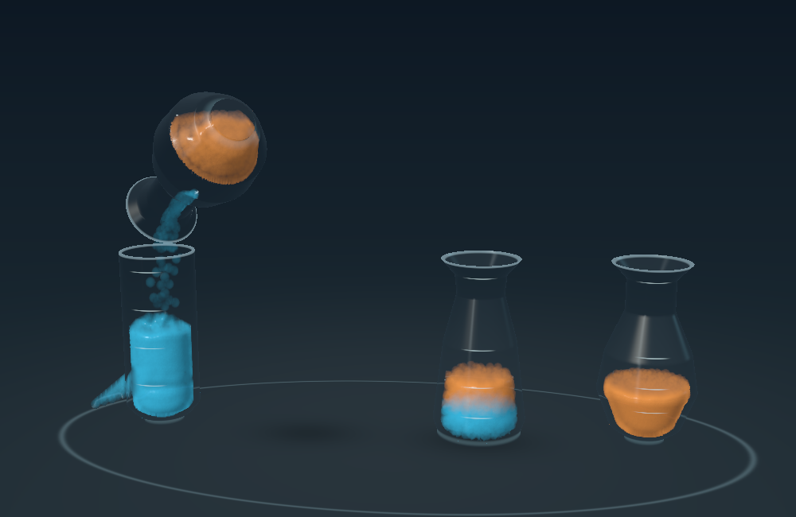

# Faster turns and invisible pour assist

September 8, 2026. The board now completes normal-speed turns in **7.18–8.08 seconds** in the measured fixtures, down from approximately 17–21 seconds in the first playable version. The user successfully ran that previous version on an iPad and reported comparable apparent speed to the Mac. This update targets animation pacing; the faster build still needs a fresh iPad play check.

## Changes

Lift/travel now takes 0.95 seconds, cutoff/untilt 0.70 seconds, and the trip home 0.90 seconds. The preparation, settling, and cleanup pauses are shorter. The fluid solver retains its 1/120-second timestep and five pressure iterations; the default simulation clock remains real time. Tilt advances faster, while the metering controller still waits for actual arrivals.

At the user's suggestion, a temporary invisible funnel guides selected airborne particles near the active destination. The cone is 0.55 scene units high, widening by 0.28 units radially above the real opening. It projects contact with that local cone inward, producing a change in particle velocity on the next solver step. It does not move a particle downward, assign destination ownership, or reach below the lip. Ownership changes at the actual vial mouth. This is a gameplay assist, not simulated visible glass or a calibrated fluid boundary.

The funnel is separate from the final cleanup. Near-misses elsewhere remain unassisted; the existing 5% limit, exact unit accounting, wrong-color protection, rollback, and undo remain in effect. Corrected particles keep the existing 0.3-second fade. Diagnostics now show **Pour assist** as a count of distinct particles that touched the guide during the current move, separately from final cleanup.

Timing constants are centralized in `LabBoardTiming` so the pose and transaction phases share their boundaries. Validation records turn duration, guided-particle count, cleanup count, and capture before cleanup, and rejects normal-speed-equivalent turns longer than 8.5 seconds.

## Results

Apple M4 Mac, unsigned Debug macOS and generic iOS builds passed. All 19 assisted test moves passed, including exact quantities, color order, conservation, collision samples, completion notifications, undo, pause, and reset. Slow motion is intentionally slower; its simulation-time-equivalent duration remains about 7.71 seconds. Median GPU time is recorded per move in each JSON; this change does not establish iPad frame timing or thermal performance.

| Fixture | Moves | Turn duration | Maximum final cleanup |
| --- | ---: | ---: | ---: |
| Five-move solution | 5 | 7.35–7.92 s | 2.66% |
| Four-move solution | 4 | 7.35–8.08 s | 2.73% |
| Three-unit top run | 1 | 7.50–7.50 s | 1.20% |
| Capacity-limited pour | 1 | 7.18–7.18 s | 0.31% |
| Last unit | 1 | 7.70–7.70 s | 0.31% |
| Pear-shaped source | 1 | 7.85–7.85 s | 0.47% |
| Portrait at 30 fps | 5 | 7.40–7.97 s | 2.42% |
| Last unit at 35% speed | 1 | 22.03–22.03 s | 0.16% |

The matching fast **unassisted** five-move control rejected its second move: only 92.11% arrived before cleanup, exceeding the allowed miss. With the guide, the assisted five-move route reached at least 97.34% before cleanup; the four-move route's minimum was 97.27%. This supports keeping the guide for the faster choreography. The control's JSON intentionally contains pacing and rollback errors; it is evidence of the disabled-assist comparison, not a passing production test.

The retained Prototype 02 pour-study water fixture also passed with the new shared shaders. The guide is disabled in that renderer.

Live Mac checks completed A → C and B → A with correct controls and quantities. The Mac locked during the next move, so the remaining live playthrough was not verified. Both complete routes passed offscreen.

## Reproduce

Run `bash Scripts/validate_fluid_board.sh` for the assisted suite, including portrait and slow motion. To repeat the unassisted control, run its generated `validate-fluid-board` executable with `--no-funnel` and the same `--library` path; a rejected move is expected. The existing `validate_fluid_lab.sh` reproduces the earlier study's full suite.

Run the **Vials Fluid Lab** scheme to try the faster default board on Mac or iPad. Existing board, surface, and glass limitations are documented in the parent Prototype 03 report.

## Matched five-second captures

With the guide:

Without the guide:

