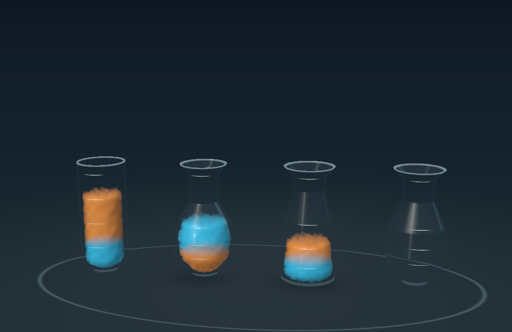
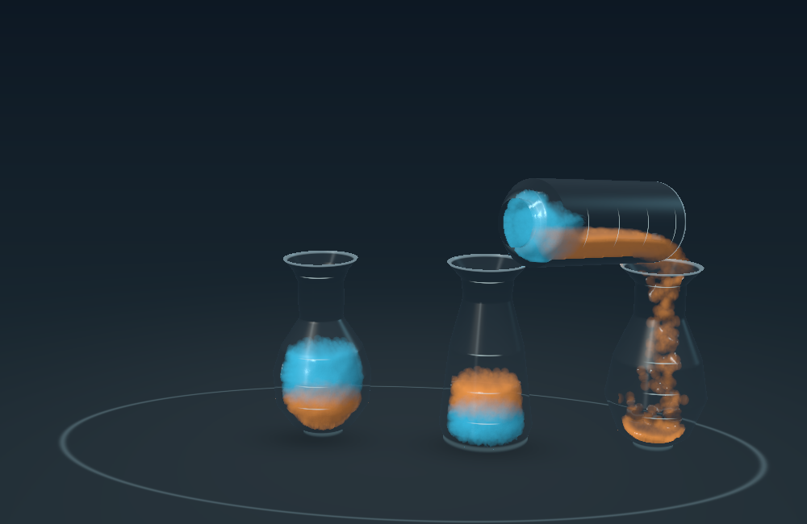
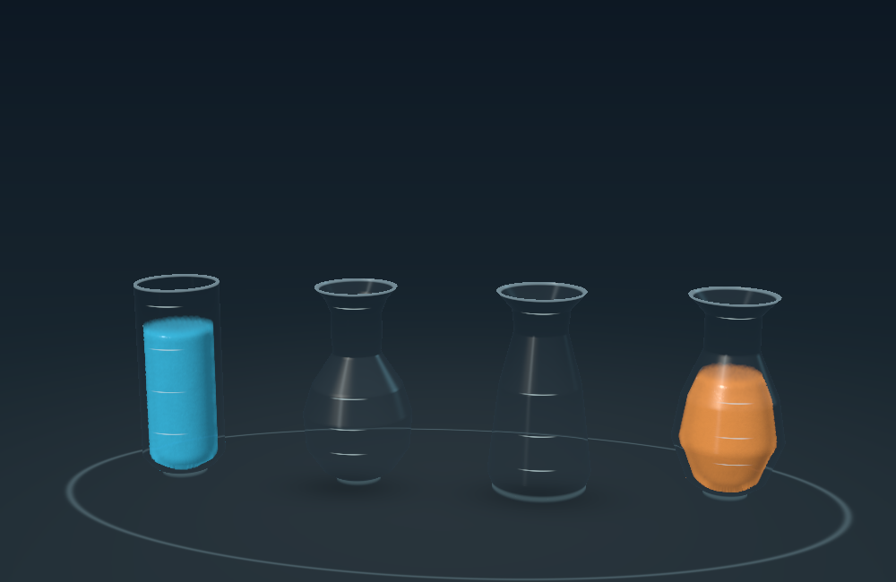

# Prototype 03 — first playable fluid board

Native Swift + Metal, tested September 8, 2026. This Lab build opens a four-vial sorting board; **Other experiments → Pour study** preserves Prototype 02, and **Classic game** opens the copied original game.

## What changed

- Four equal-capacity 3D cavities: rounded vial, bulb flask, tapered flask, and pear flask. Graduation heights and initial layer boundaries come from integrating each interior profile, so equal units have different heights in wide and narrow regions.
- A playable two-color, eight-unit puzzle with source/destination selection, capacity-limited pours, invalid-move feedback, a shortest-path hint, completion, exact undo, and reset during a pour.
- One-, two-, and three-unit transfers use the same particle simulation. The moving vial lifts above its neighbors, travels into position, tilts, meters the permitted top layers, stops the stream, and returns. The board has 5,120 particles, 640 per unit; only the active source/destination pair runs physics.
- Tide blue and Ember orange retain distinct layer identities. Adjacent units of the same color share a fluid region, avoiding artificial seams. Sorting commits only after exact particle ownership and color inventories are verified.
- At most 5% of the intended transfer may be restored during final cleanup. Larger misses roll back the move. Any corrected particles fade in over 0.3 seconds, then settle before commit.
- Pause, slow motion, particle view, camera orbit, and diagnostics remain available. Idle boards stop simulation and repeated GPU rendering. A live-discovered completion notification issue is fixed: controls are updated before the renderer enters idle.

## Measured checks

Apple M4 Mac, Xcode 27.0 (27A5237l). Unsigned Debug builds succeeded for macOS and generic iOS. The iOS build establishes compilation only; installation, touch ergonomics, sustained device performance, and thermal behavior await the physical iPad.

| Check | Moves | Lowest arrival before cleanup | Largest cleanup |
| --- | ---: | ---: | ---: |
| Five-move solution | 5 | 100% | 0 |
| Shortest four-move solution | 4 | 99.844% | 3 of 1,920 |
| Three-unit top run | 1 | 100% | 0 |
| Nearly full destination / partial top run | 1 | 100% | 0 |
| Last unit empties its source | 1 | 99.688% | 2 of 640 |
| Pear flask as source | 1 | 100% | 0 |
| Portrait, 600 × 760, 30 fps | 5 | 100% | 0 |

All 18 moves committed with exact quantities, zero wrong-color ownership, and no nonfinite particles. Checks cover settled color ordering, conservation, exact particle undo snapshots, illegal/overlapping moves, pause, and reset during a pour. The final five-move run also asserts delivery of the completion notification used by the UI. All sampled moving-glass penetration values were zero. An additional geometry sweep checked all 12 ordered source/destination pairs through the tilt range with zero sampled penetration; this is a sampled check, not an analytic collision proof.

For the final five-move 1,000 × 650 run, median GPU time was 3.46–3.58 ms per rendered frame on the M4. Portrait at 30 fps ran four fixed physics steps per frame and measured 6.16–6.37 ms median GPU time. These offscreen measurements do not predict iPad performance. Each normal-speed move currently takes approximately 17–21 seconds, intentionally slow enough to study the pour.

The retained Prototype 02 water fixture also passed after the shared-shader changes: exact 2,122/1,061 final particle counts, no final spill, four corrected particles, and successful reset checks. See the adjacent JSON files for measured results.

Live macOS checks confirmed source selection, incompatible-destination rejection, hints, and a two-unit transfer. A completion-notification bug found in live testing was fixed and the first pour after restart correctly re-enabled controls. The Mac locked during the next move, so the remaining live playthrough and menu checks are pending; the full solutions above were verified offscreen.

## Play and reproduce

Open `Vials Fluid Lab.xcodeproj`, choose the **Vials Fluid Lab** scheme, and run. Tap a filled vial, then a matching top color or an empty vial. The A–D buttons below the scene also select vials. **Hint** selects the source and highlights the proposed destination. A short solution is A → C, B → A, C → B, A → C. Undo works after any committed move, including after solving.

Run `bash Scripts/validate_fluid_board.sh` for the board checks. Run `bash Scripts/validate_fluid_lab.sh` for the earlier study's full suite. The validators render using the same Metal code as the interactive app, save captures and JSON, and exit nonzero on failed assertions.

## Deliberate prototype limits

This is a sorting-mode visual simulation. Lower-color regions are constrained in the vial's local height coordinates and the mouth is gated to the selected parcels; they do not freely rearrange under gravity when tilted. Once released, the top liquid forms a simulated stream. The color constraints preserve puzzle rules, but are not a calibrated immiscible-fluid or density model. Color blending in the shader is optical, not a chemical mixing mechanic.

Unit accounting, initial fills, and marks use exact cavity volumes. Particle packing and the rendered resting surface remain approximate, particularly in narrow necks; 99.7% transfer capture describes particle ownership, not measured free-surface volume accuracy. The initial seed and fast streams can still look granular. Glass uses approximate optical shading rather than physical refraction through multiple transparent surfaces. Motion timing, surface finish, sound/haptics, additional levels, persistence, and iPad performance tuning remain later work.

## Captures

