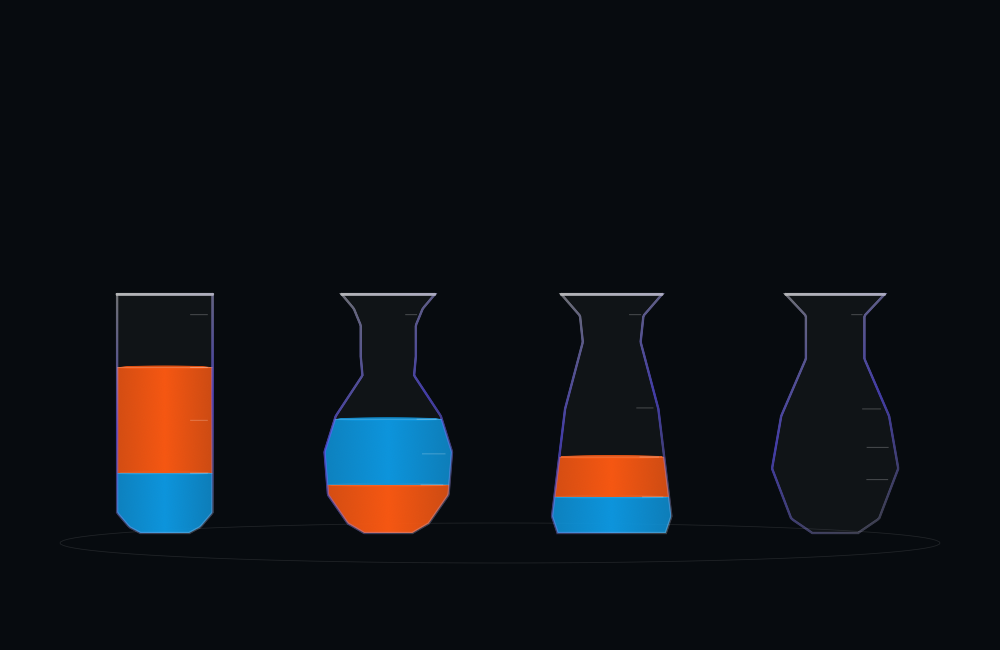
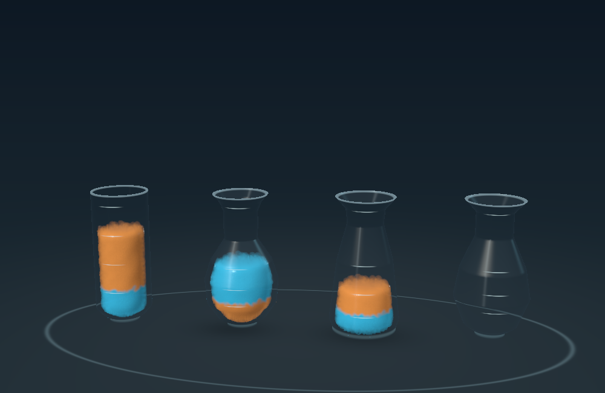

# Prototype 04 — matched Classic and Fluid play

September 8, 2026. Swift + Metal on Apple M4 Mac; signed iOS build for Eddie's M4 iPad Pro. The Lab has its own [new icon](Icon.md).

## What changed

- Three puzzles share the same rules, move count, hints, undo history and saved progress in both presentations. Switch Classic / Fluid between moves, or change puzzles and return later. Relaunch restores the last committed move.
- Classic uses a flat SwiftUI Canvas with the same vial profiles and volume heights. It is a comparison adaptation, not a port of every visual detail from the original game. The original full game remains under Other experiments → Original game.
- Relaxed and Quick pacing apply to both presentations. Quick advances the same fixed-step fluid simulation at 1.6×; it does not enlarge the physics timestep.
- Fluid surfaces use wider depth smoothing and a filtered front-surface color identity, reducing grain and unwanted blending through neighboring layers. The invisible receiver funnel and the 5% cleanup ceiling remain.
- Board diagnostics can record a session and share a local JSON report with move durations, animation intervals, host update/encode wall time, Fluid GPU time, thermal state and available battery observations. No report is uploaded automatically.

## Verification

All 63 reported comparison/board transfers passed, with no sampled vessel penetration in the board fixtures:

| Suite | Transfers | Result |
| --- | ---: | --- |
| Three puzzles × two paces, switching presentations | 26 | Exact rules, completed solutions and shared undo |
| Relaxed board matrix, including one slow-motion case | 19 | Exact ownership/color counts, pause/reset/undo |
| Quick board matrix, including portrait at 30 Hz | 18 | Same invariants |

Additional checks passed for serialized progress/history, per-puzzle restoration, busy-action guards, cached Fluid snapshots across switches, Classic without Metal, and the retained two-vial pour study. Live Mac checks confirmed a Classic move, a Fluid move on the same board, undo across modes and restoration after quitting/relaunching.

| Offscreen board pacing | Observed normal-speed turns | Largest final cleanup |
| --- | --- | --- |
| Relaxed | 7.20–8.10 seconds | 2.89% |
| Quick | 4.52–5.07 seconds | 2.27% |

These ranges are deterministic fixture timing, not a claim that every device will sustain the required frame rate. The mixed-presentation fixtures can be a little faster after reseeding from an exact Classic state. Classic's programmed turn takes approximately 7.6 seconds Relaxed / 4.75 seconds Quick.

Reproduce with `bash Scripts/validate_comparison.sh` and `bash Scripts/validate_fluid_board.sh`. The retained pour study uses `bash Scripts/validate_fluid_lab.sh`. JSON evidence and selected captures are beside this document.

## Device measurements and limits

The initial iPad candidate completed 24 Quick Fluid turns without failure in 119 seconds before automatic lock suspended the app. Turns took 4.60–5.19 seconds; median draw interval was 16.67 ms, p95 16.73 ms, median GPU work 8.70 ms and p95 12.67 ms. Thermal state remained nominal. This was before the final additional color-filter passes: it is useful baseline evidence, not a final-polish benchmark. See [raw iPad baseline](ipad-fluid-quick-initial.json).

The iPad battery remained full throughout, so this run establishes neither battery drain nor battery life. A final matched on-device comparison and an unplugged battery session remain pending an unlocked iPad. See [the short tester protocol](Testing.md).

Each final-source Mac trial completed 18 Quick turns in 90 seconds, with no failed moves and nominal thermal state. Fluid turns took 4.63–5.10 seconds, with at most 2.66% cleanup. Median Fluid draw interval was 20.00 ms (about 50 draws/second), p95 20.46 ms; median GPU work was 9.39 ms, p95 10.84 ms. Classic's animation update interval was 17.23 ms median, 18.15 ms p95. Each run had one recorded interval over 25 ms.

See [Mac Classic report](mac-classic-quick.json) and [Mac Fluid report](mac-fluid-quick.json). Classic intervals measure animation updates; Fluid intervals measure MTKView draws. Host wall time includes update/encoding and waits, not CPU utilization or total SwiftUI rendering cost. These are development-build observations on this machine, with other Lab instances open, not controlled energy measurements or proof of matching frame rate between devices.

## Remaining visual and physics limits

This remains an assisted game simulation. Color layers are constrained, particle packing approximates volume, and the final correction may recover up to 5% of transferred particles. The funnel only guides eligible airborne pour particles toward the receiver. It is not calibrated density, viscosity, mixing or surface tension. Small scallops remain along the liquid silhouette and color boundaries. The icon is illustrative artwork, not an in-game screenshot.

Next evaluation: have testers compare the same puzzle and pace in both modes, then choose the default presentation and turn speed from their feedback. Use the final iPad measurement before further GPU-heavy polish.
