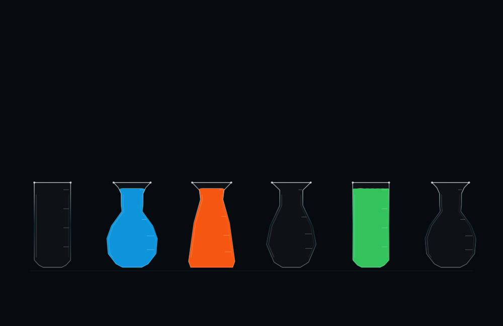

# Consistent 2D fill levels

The 2D fluid no longer drops when a destination is selected or expands into a new layout when a pour finishes. The old solver compressed its particles more densely than the area-based resting layout; rebuilding that layout at the end could raise the surface by roughly a quarter of the vial height. The previous missing-particle correction counter did not measure this visual error.

The fix preserves correctly arrived particles through cleanup, keeps an untouched destination asleep until liquid actually reaches it, and preserves the cached settled arrangement when returning to 2D with the same puzzle state. Particle spacing, relaxation and the particle-radius offset now agree with the area-based fill marks. A falling droplet contributes to the fill-height bound only after touching the liquid body. The receiver's same-color band includes newly joined particles; the source's retained band excludes the units being poured.

This remains an assisted particle simulation: shape-derived area bounds stabilize the liquid body while droplets flow freely above it. It does not implement unrestricted incompressible fluid dynamics or mixing. The visible surface is now flatter, and the additional relaxation work costs some CPU time.

## Checks

All 98 authored solution moves across all 12 puzzles passed. The new assertions require unchanged destination particles during the first 0.4 simulation seconds, no meaningful surface shift during cleanup, preserved positions for particles already in the receiver, and final fill height within 5% of vial height of the area-derived mark. The final run measured zero activation shift, zero cleanup shift and at most 0.373% final height error. Missing-particle correction remained at most 1.042%, below the separate 5% allowance. Inactive particles remained unchanged and sampled vial polygons did not intersect.

Quick pours took 4.25–4.93 seconds on the test clock. The median of per-move solver CPU medians was 1.58 ms (initial experiment: 1.17 ms). This excludes Canvas drawing and is not a battery or total frame-cost measurement. [Raw results](validation.json).

Session checks passed pause, suspension, reset, save/reload, three-way presentation switching, exact preservation of settled 2D particles across a Classic round trip, Classic/3D moves followed by undo in 2D, and operation without a Metal simulation device. [Session output](session-validation.txt).

Both optimized Mac and signed iOS builds passed. The updated app installed and launched normally on the iPad. Live Mac checks completed A→B, E→B and E→A on Green arrival; the nearly full A held its level at selection and filled to its final mark. Undo restored the original zero-move board, with 2D Fluid / Quick still selected. No on-device battery benchmark was run.

## Compare the result

[Nearly full, before selection](2d-nearly-full-before.png) · [During positioning](2d-nearly-full-selected.png)

[Full, just before cleanup](2d-full-before-cleanup.png) · [Full, after cleanup](2d-full-after-cleanup.png)

The full-board PNGs before and after cleanup are byte-identical in this captured Green arrival example. The automated checks cover all 98 fixture pours.

Reproduce with `bash Scripts/validate_fluid_2d.sh /tmp/vials-level-check`.
