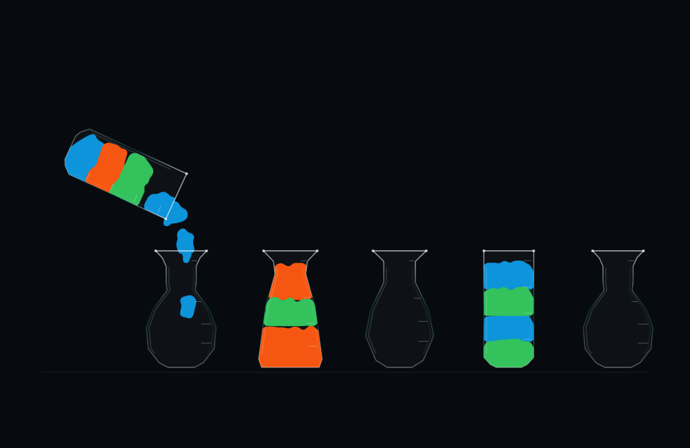

# Prototype 06 — 2D Fluid experiment

September 9, 2026. A separate planar particle simulation in the existing native app; no Unity or new engine dependency.

**Current build includes the [fill-level stability fix](LevelStability/README.md).** The implementation and measurements below describe the initial experiment; the linked report supersedes its whole-vial repacking behavior, performance numbers and pending device-check status. Correctly arrived particles now retain their positions through cleanup.

## Try it

Choose **Green arrival → 2D Fluid → Quick**. Pour A into B, then try the same move in Classic or 3D Fluid using Undo. Presentations share the exact puzzle state, unit identities, saved progress, hints and undo history. All 12 existing puzzles work in 2D. Board diagnostics offers Show particles, Slow motion and session recording. The previous sound stays unchanged.

[Resting board](2d-idle.png) · [Portrait](2d-portrait.png) · [Settled result](2d-end.png)

## What is different

The new solver uses two-component positions and velocities, 96 equal-area particles per unit, a planar spatial grid, particle separation/cohesion, damping and gravity at a fixed 120 Hz simulation step. Only the source, receiver and airborne particles are active during a move. Settled boards do not run the solver. The six-vial puzzles use 1,152 particles, compared with 7,680 in 3D.

Vial silhouettes retain the tube, bulb, taper and pear forms. Their widths are normalized to equal usable area, and fill marks integrate width over height. An equal unit therefore rises farther through a neck than through a bulb. These are area-based planar containers, not flattened 3D volumes.

SwiftUI Canvas blends particle disks with blur and an alpha threshold into flat colored liquid. Glass is an illustrated outline with restrained highlights. There is no depth reconstruction, perspective, volumetric lighting or out-of-plane movement. Canvas still uses system graphics resources: a CPU solver does not mean GPU-free drawing. The 3D-only Fluid detail setting is disabled in 2D, which currently draws at native view resolution.

This is an assisted game simulation. Unlike colors retain readable layer bands; liquid is carried with a moving vial before gravity redistributes it. A local invisible funnel helps airborne particles near the destination mouth. Arrival ownership requires entering that mouth. The source returns only once at least 95% has arrived and nearly all selected particles have departed. A timed-out transfer restores the original state. At the end, the two active vessels gently repack their layers; the missing-particle correction is counted separately. Inactive vials remain unchanged. Density sorting and color mixing are not implemented.

## Validation and limits

All 98 moves in the 12 authored shortest solutions passed with exact final puzzle state, finite particle positions and unchanged inactive particles. The final fixtures needed **0% missing-particle correction** after settling; the 5% limit remains in place for other paths. Sampled polygon-edge checks found no moving-vial intersections. These fixture results do not establish perfect behavior for every possible move sequence.

Quick moves took 4.20–4.95 seconds on the test clock. The median of per-move CPU medians was **1.17 ms per update**, using optimized Swift on the M4 Mac at 60 test updates per second. This measures the solver only, excluding Canvas drawing and geometric validation. It cannot be directly compared with the previous 3D GPU timings or used to claim battery savings. See [raw solver results](solver-validation.json).

Integration checks passed 2D commit, pause, background suspension, busy-control guards, reset during a move, saved-state reload, switching all three presentations, Classic and 3D moves followed by undo in 2D, and 2D play without a Metal simulation device. Landscape, portrait and mid-pour captures were inspected. Reproduce with `bash Scripts/validate_fluid_2d.sh /tmp/vials-planar-check`.

Final optimized macOS and signed iOS builds passed. The iPad build installed successfully. Its short playback trial could not launch because the iPad was locked, so there are no on-device performance or battery results for this version yet. On the Mac, the final build restored 2D saved progress, Undo restored the initial board, and the 2D diagnostics appeared correctly. The Mac locked during the remaining live-animation check; that check remains pending. The offscreen rendered sequence and automated animation/integration checks passed.

The next decision is visual: compare the smoothness, readability and character of the three presentations at the same pace. Follow with matched iPad rendering/energy measurements before concluding that 2D is faster overall.
