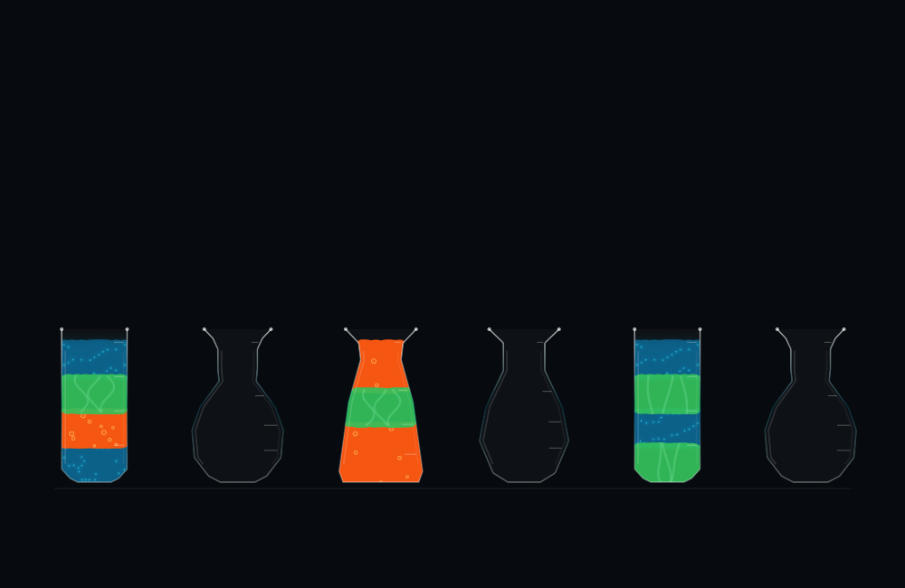
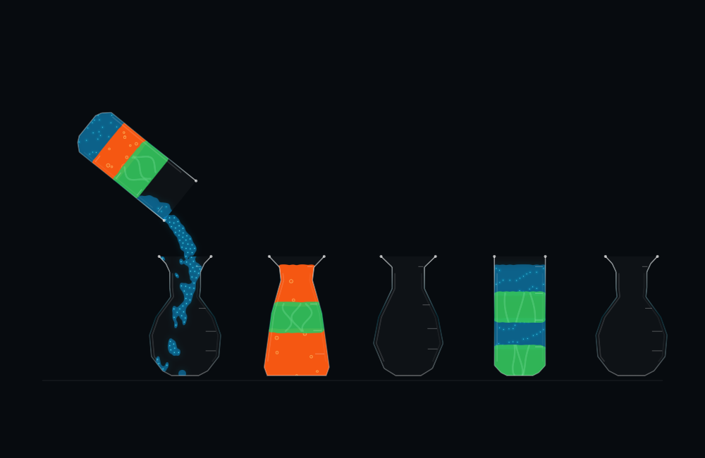

# 2D fluid materials and quicker turns

The 2D experiment now separates the liquid resting in a vial from liquid being poured. Releasing and airborne particles have weaker attraction, and the surface renderer uses narrower, velocity-aligned droplets with less visual blending. The resting density, shape-derived fill bounds, receiving funnel and preservation of successfully arrived particles remain in place.

Quick uses shorter lift, positioning, tilt, return and settling phases while keeping the physics step at 1/120 second. Relaxed retains its previous choreography. Classic and 3D pacing are unchanged.

Blue has a translucent body, cyan glow and small bright cores. Orange has rising decorative bubbles that fade and expand near the surface. Green has soft moving highlight ribbons. Details are masked to their own fluid, follow the vial pose, and use per-vial clocks that advance only during a turn. Other vials and an idle, paused or suspended board do not animate. Bubbles are a visual effect; they do not displace liquid or change the puzzle rules.

## Validation

All 98 solution moves across all 12 authored puzzles passed. Quick turns took **3.33–4.22 seconds**, median **3.74 seconds**, compared with 4.25–4.93 seconds before this change. Total duration for the same route set decreased **18.8%**. Per-move reductions ranged from 14.5% to 22.2%; the median reduction was 19.0%. These are elapsed test-clock durations at the intended playback speed, not device frame-rate or battery measurements.

There was **zero measured destination level shift at selection or cleanup**. Final height error was at most **0.361% of vial height**, and missing-particle correction was at most **0.521%**, below the separate 5% allowance. Arrived positions were preserved, inactive particles and material clocks stayed unchanged, idle simulation calls did not animate materials, and sampled vial polygons did not intersect. [Full results](validation.json).

A Green arrival comparison against the prior engine supports the stream improvement: all seven single-unit pours had longer first-to-last departure intervals and smaller maximum per-frame departure batches. For its final single-unit pour, the departure interval increased from 0.56 to 1.42 simulation seconds and the maximum batch fell from 8 to 4 particles per displayed frame. The complete turn nevertheless fell from 4.93 to 3.95 seconds. These measures describe release distribution, not a claim of physically exact fluid behavior. [Prior-engine comparison](baseline-stream.json); new rows are in the full results above.

The nine-move Green arrival route also passed with [Relaxed pacing](relaxed.json) and at [30 fps](30fps.json). Session checks passed commit, pause, suspension, reset, busy guards, save/reload, three-way presentation switching, cross-presentation undo and operation without a Metal simulation device. [Session output](session-validation.txt).

The optimized macOS and signed iOS builds both succeeded. The iPad installation succeeded, but launch was denied because it was locked. The Mac was also locked, so live visual and touch checks are pending. Landscape and portrait images above were rendered offscreen from the real SwiftUI Canvas. No device battery or total rendering-cost benchmark was performed.

The [before](2d-full-before-cleanup.png) and [after](2d-full-after-cleanup.png) cleanup captures retain the fluid level. Unlike the earlier solid-color version, decorative details can move during this interval; pixel identity is no longer the criterion for level stability.

## Reproduce

Run `bash Scripts/validate_fluid_2d.sh /tmp/vials-material-check` on a Mac with the Xcode Metal toolchain. This builds the release app, replays all authored solutions in Quick, runs the additional Relaxed and 30 fps cases, and performs session checks with image captures.

The particle model remains assisted and optimized for a readable sorting puzzle. It can still form small ligaments or droplets, and the new materials need tester feedback on a live display. Mixing, density differences and simulated gas bubbles remain future gameplay work.
