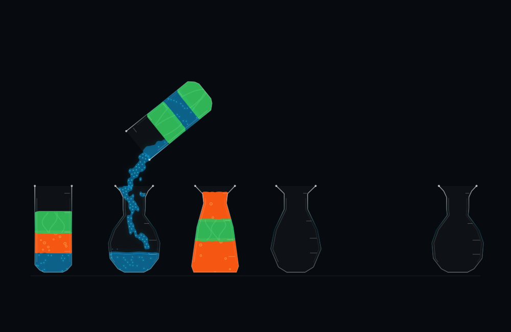

# Surface response, material character and iPad checks

The 2D liquid now reacts where incoming particles join the receiver's liquid body. Blue has fine splash accents and quick ripples. Orange has impact bubbles and bubble outlines within its falling stream. Green has broader, slower ripples, longer-looking droplets and softer highlight ribbons. Shared `Lab2DMaterial` settings control wave height, frequency, damping, splash speed and spatial harmonics.

These are visual responses. Ripples displace only the rendered surface band, with zero mean over the sampled width and a maximum displacement of 0.022 scene units (under 1% of vial height). They do not modify the physical particles or puzzle units. At most ten small splash accents exist at once; they are clipped to the receiving vial and disappear below its liquid surface. Their ballistic paths and the ripple phase advance on the worker's simulation clock, so pause and suspension freeze them.

An explicit settling envelope brings the effects to zero before final cleanup. The existing 5% missing-particle allowance, exact unit identities and fill-level checks remain unchanged. No idle animation timer was added. This does not introduce density sorting, real simulated gas, color mixing or new puzzle rules.

## Appearance

[Orange impact and stream bubbles](2d-impact-color-1.png) · [Green surface and highlights](2d-impact-color-2.png)

## Validation and reproduction

Run `bash Scripts/validate_fluid_2d.sh /tmp/vials-surface-check` for the authored physics routes, level stability, effect bounds, pause/reset checks and rendered captures. Ripple sampling checks the mean and maximum height; replay checks ensure effects are absent at cleanup, bounded in count/energy and frozen at idle.

Run `bash Scripts/benchmark_2d_rendering.sh /tmp/vials-render-check` for the controlled Mac offscreen comparison against the renderer at commit `1f515c2`. Both renderers use the same particle snapshots and image size, alternate execution order, and draw the result into a CPU bitmap. This measures host offscreen image creation/drawing, not the iPad GPU or display compositor.

The explicit trial flag `--check-controls`, used with `--lab-trial --presentation fluid2D`, exercises pause, suspension, resume, reset, commit, undo and save/reload on the device before measurement starts. It calls the same session actions as the controls; it is not an automated finger-touch test. Trial mode has no persistent gameplay defaults and never saves over the user's game.

## Regression results

All 98 authored solution moves passed. Maximum physical fill-height error remained 0.361% of vial height, and maximum missing-particle correction remained 0.521%. Selection and cleanup height shifts were zero. All arrival/departure counts, turn durations, cleanup percentages and physical height metrics exactly matched the previous 98-move report. Additional assertions cover bounded effects, inactive material state, effects hidden at cleanup, and no idle updates. The Green arrival route also passed at 30 fps and Relaxed pace. [Raw results](validation.json).

The [session check](session-validation.txt) passed pause, suspension, reset, worker snapshots, delayed-frame handling, commit, undo, save/reload, three-way presentation switching and the no-Metal fallback. Blue/orange/green impact captures were inspected.

## Added rendering cost

At 1000×650 on the Mac, the controlled offscreen comparison measured median rest rendering of 2.066 ms before and 2.096 ms after. Impact rendering measured 3.119 ms before and 3.226 ms after: approximately 0.107 ms added, or 3.4%. Forty samples per variant were interleaved after warmup. These include drawing the generated image into a CPU bitmap; they are not iPad GPU timings or a battery-life estimate. [Raw rendering measurements](render-cost.json).

## Device procedure

These trials used an isolated measurement app (`devplaceholder.A4UPBIXV.VialsFluidLabChecks`) on the 13-inch M4 iPad Pro over its wireless developer connection. The normal game and its saved progress were kept separate. Each presentation ran the Green arrival solution repeatedly for ten minutes at Quick pace with the iPad unplugged, Low Power Mode off, and no screen mirroring or Instruments recording. Trial arguments were `--lab-trial --presentation classic|fluid|fluid2D --pace quick --puzzle greenArrival --seconds 600 --keep-awake`. The final 2D trial also used `--check-controls` before the timed sample.

The iPad test app temporarily disabled its own idle timer and restored the prior value after the trial. A timed Mac `caffeinate -i` assertion was used for the final portion of the checks; it affects Mac idle sleep, not iPad auto-lock. No lock settings were changed.

Release builds passed for macOS and signed iOS. The final Mac diagnostic run passed all seven controller checks: pause, suspension, resume, reset, commit, undo and save/reload. [Mac control report](mac-controls.json).

## Unplugged iPad results — September 10, 2026

| Presentation | Completed turns in 10 minutes | Median turn | Median / p95 callback interval | Reported battery | iOS thermal state |
| --- | ---: | ---: | ---: | --- | --- |
| Classic | 124 | 4.763 s | 17.286 / 17.382 ms | 85 → 85% | Nominal throughout |
| 3D Fluid | 134 | 4.405 s | 16.666 / 16.755 ms | 85 → 80% | Nominal throughout |
| 2D Fluid, new effects | 161 | 3.635 s | 17.768 / 17.936 ms | 80 → 80% | Nominal throughout |

All three trials completed normally. All recorded turns committed; maximum correction was 0% in Classic/2D and 0.547% in 3D. The last incomplete turn at the timed boundary is excluded. All seven pre-trial controller checks passed on the iPad. The 2D median turn was 3.636 s over the first full nine-move cycle and 3.632 s over the last full cycle, showing no sustained slowdown in this sample.

The same first 16 2D moves took a median 3.6195 s before surface polish and 3.6204 s afterward (about 0.025% difference). The baseline was a 60-second run on the optimized renderer at `1f515c2`. Its median/p95 controller intervals were 17.770/17.925 ms, compared with 17.768/17.936 ms across the new ten-minute run. These observations show the new effects did not materially slow this route. Turn times include each presentation's animation/pour policy; they are not a pure rendering-speed benchmark. Callback intervals are controller updates for Classic/2D and MTKView draw callbacks for 3D, not measured compositor presents or universal FPS.

Battery observations were coarse: only 85% and 80% appeared in the samples. An unchanged reading does not mean zero energy use, and a five-point change does not establish an exact five-point consumption for that interval. The sequential runs were not randomized or brightness-controlled, so they do not establish a precise battery ranking or hours of battery life. Nominal thermal state means iOS reported no thermal-pressure escalation; no physical temperature was measured. Sustained on-device checks cover Green arrival; the 98-move offline regression covers all authored puzzles.

Raw reports: [Classic, 10 minutes](ipad-classic-10min.json), [3D, 10 minutes](ipad-3d-10min.json), [2D, 10 minutes and control checks](ipad-2d-10min.json), [2D baseline, 60 seconds](ipad-2d-baseline-60s.json).

## Delivery

The final signed Release build was installed and launched as the normal Vials Fluid Lab app on the iPad. The separate measurement app was removed after all reports were copied out. The existing game container was retained. The macOS Release build also passed; no Xcode project or scheme settings changed in this update. The original Vials project was not modified.
