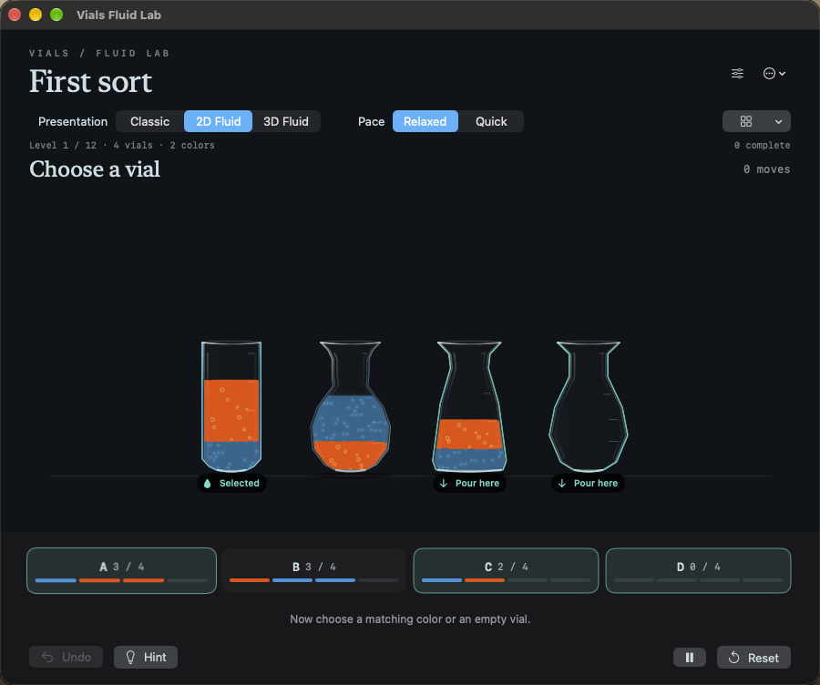

# Glass, interaction feedback and matched pour comparisons

The 2D vials now have a visible glass wall, a curved rim, restrained edge reflections and a thicker base. Glass is drawn around the existing interior profile: the particle solver, collision boundary, equal-area fill heights and cleanup behavior are unchanged. The center of each liquid layer stays clear enough to read its color and material details.

Selection now outlines the source and labels legal destinations “Pour here.” A rejected destination gets a brief amber “Cannot pour” cue while preserving the source. Full, single-color vials receive a “Complete” badge and a checkmark on their selection card. Text and symbols accompany color cues, and accessibility values expose the same statuses. Selection/rejection card movement is suppressed with Reduce Motion enabled; no repeating idle animation was added.

## Comparing presentations

Open **Board options → Compare last pour** after completing a move. Before the first move, the menu offers **Compare a pour** using a legal transfer from the current board. With a source selected, it chooses a legal destination for that source. The sheet identifies the source, destination, color and amount before playback.

Choose Classic, 2D Fluid or 3D Fluid and press **Replay pour**. **Match duration** defaults on and aims for about five seconds in each mode. Turn it off to compare each mode at its normal Quick pace. Pause, Resume, Stop and Done work during playback; presentation and timing changes are disabled while a pour is active.

The preview owns disposable sessions with no persistent gameplay defaults. Each replay starts from the same captured unit IDs and board state. Preparation measures the transfer's simulation duration in 2D and 3D, then adjusts playback speed rather than changing the physics. Classic has a fixed animation duration. The 3D preparation uses the real Metal solver with a small offscreen render target. Preparation can take a moment; unavailable 3D leaves Classic and 2D usable. Done restores the untouched main board. The most recent pour is kept for the current session; reset, undo or changing puzzles clears it.

Menu availability uses a cheap legal-move check rather than running a puzzle search on board redraws. Closing or stopping a preview cancels its clock; a weak-reference regression verifies the abandoned worker session is released.

## Validation

Run `bash Scripts/validate_glass_comparison.sh /tmp/vials-glass-check`. It builds the Mac app, runs the new comparison and feedback checks, then runs the existing controller and visual capture suite with the Metal renderer.

The comparison tests exercise one-, two- and three-unit transfers across all three presentations, including a nearly-full receiver. Every resulting board matches the expected exact unit transfer. In controlled 60 Hz stepped tests, all nine matched pours finished between 5.00 and 5.07 seconds. This checks playback normalization, not actual display-presentation timing or an iPad frame-rate guarantee. [Raw comparison results](comparison.json).

Other checks cover invalid source/destination taps, retained selection, legal destination availability, hints, completed-vial detection, busy guards, normal Quick pace, stop/pause, stale replay clearing after undo, saved-board isolation and the no-Metal fallback. The existing session suite passed asynchronous worker cancellation, pause/suspension, save/reload, cross-presentation undo, delayed-frame accounting and rendered captures. The physical 2D solver file is byte-for-byte unchanged from `9673d4e`.

Live Mac UI checks used a separate disposable app. Selection, invalid-destination feedback, a four-move route producing a completed vial, opening the comparison through the options menu, replaying in 3D and returning to the unchanged board were checked. The first screenshot exposed a wrapped “Selected” label; the final capture verifies the fix. Both normal macOS and signed iOS Release builds passed.

## Rendering cost

`bash Scripts/benchmark_2d_rendering.sh /tmp/vials-glass-render 9673d4e` compares against the prior glass using identical particle snapshots at 1000×650. A repeat after builds and the test UI had stopped measured median offscreen creation/drawing of 3.187 → 3.520 ms at rest and 2.240 → 2.721 ms at impact: about 0.33–0.48 ms added. Forty samples per variant were interleaved after warmup. These are Mac ImageRenderer plus CPU bitmap-draw measurements, not iPad GPU/compositor timings or battery estimates. The earlier sample overlapped other work and was noisy; both raw samples are retained for context. [Quiet sample](render-cost.json), [earlier sample](render-cost-initial.json).

## Screens

[Selected source and legal targets](board-selected.png) · [Rejected destination](board-invalid.png) · [Completed vial](board-completed.png) · [Comparison sheet](comparison-window.png) · [3D comparison playback](comparison-3d-playing.png)

## Delivery

The final signed Release update was installed on the iPad under the existing Vials Fluid Lab identifier, retaining its app data. The separate Mac UI-check app was closed after testing. The normal Mac Release build passed from the updated project. No Xcode project or scheme edits were needed. No sound, mixing, density or puzzle-rule changes were made.
