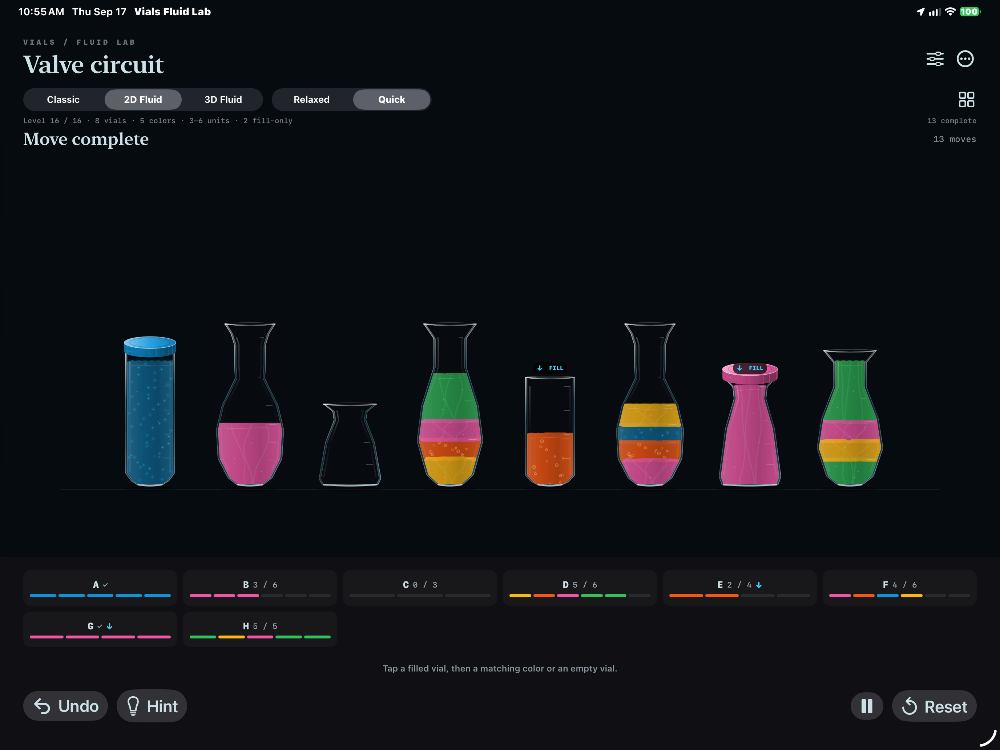
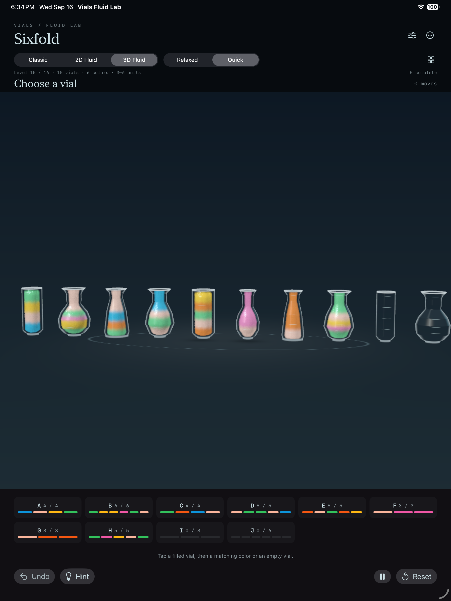
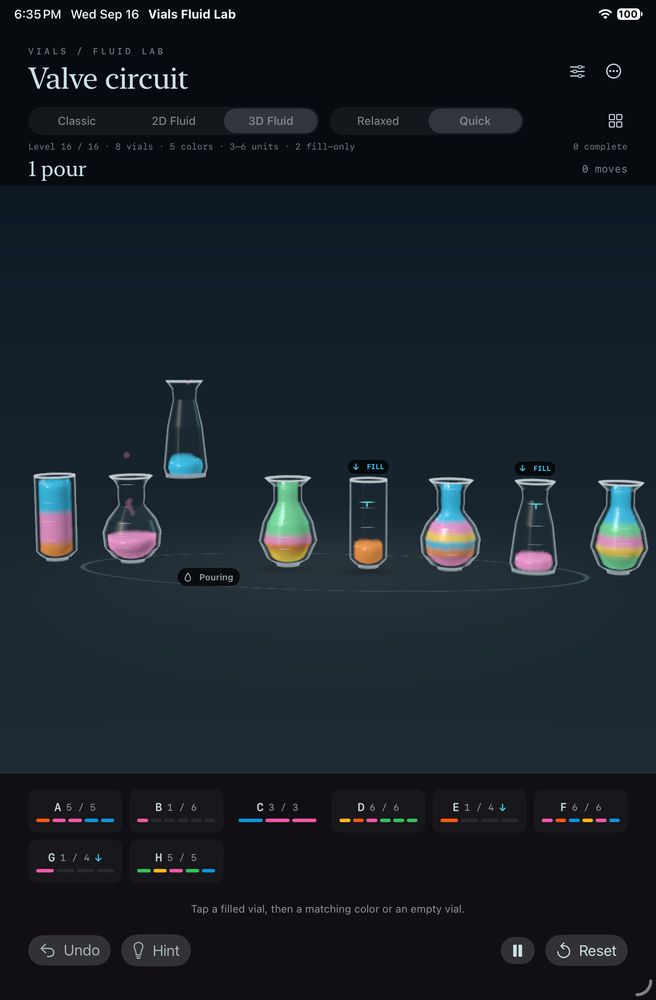
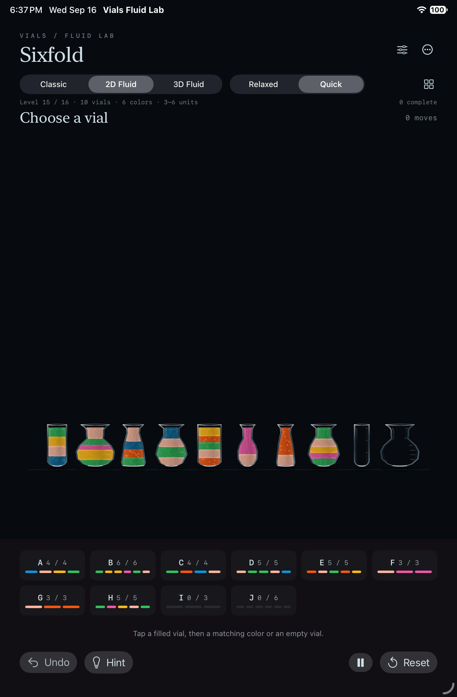
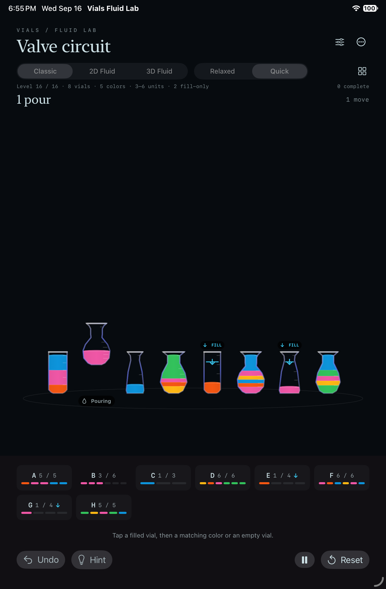
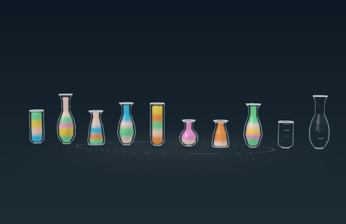
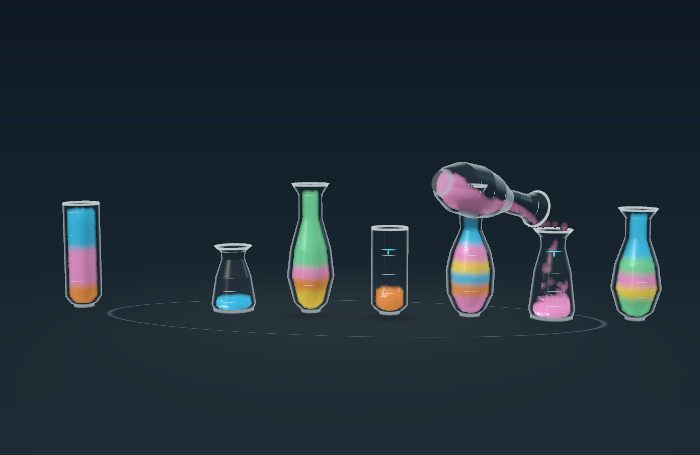

# Variable-capacity and receive-only Lab boards

The shared Lab board now supports different logical capacities per vial and destination-only valves. Four fixed puzzles extend the progression from 12 to 16 levels and deliberately exercise larger boards, more colors, taller vessels and longer pours before further performance tuning.

| Level | Vials | Colors | Capacities | Special rule | Verified route |
| --- | ---: | ---: | --- | --- | ---: |
| Five streams | 8 | 5 | 3–5 | — | 36 moves |
| Tall order | 8 | 5 | 3–6 | — | 44 moves |
| Sixfold | 10 | 6 | 3–6 | — | 51 moves |
| Valve circuit | 8 | 5 | 3–6 | 2 fill-only vials | 44 moves |

The fixtures are fixed outputs from the bundled Original game's deterministic Hard curriculum. They are authored Lab levels, not runtime-generated boards.

## Rules and presentation

`LabBoardState` now stores a capacity and rule for every vial. Older saves containing the original scalar capacity decode as uniform-capacity boards, and a new-format round trip is covered by validation. Legal moves, completion, reservations, hints and canonical solver keys all use the per-vial metadata. A fill-only vial can receive and complete normally but cannot be selected as a source.

All three presentations use capacity-aware fill heights and markings. Vessel height now scales directly with capacity: a three-unit vessel is 75% of the four-unit reference height and a six-unit vessel is 150%. Identical shapes retain the same width and per-unit volume, so capacity is visible in the silhouette instead of through a subtle width change. Fill-only vials retain the explicit `↓ FILL` badge and capacity-card arrow; the redundant cyan line and arrow inside the Classic and 2D glass were removed after they read as a stray liquid boundary. The 3D shader palette and simulation grid accommodate the six-color, ten-vial board.

The largest puzzles made synchronous hint search noticeable, so hints are computed off the main actor and expose a short `Finding…` state. A solved hint route is retained while the player follows it; the next hint advances along that route instead of launching a fresh search that can recommend immediately undoing the previous hint. A different player move, changing level, reset or undo invalidates the retained route.

Concurrent play is no longer capped at two active pours. Reservations still reject dependencies—a new source cannot be an existing source or destination, and a moving source cannot become a destination—but every independent ready transfer may start. The 3D renderer provisions simulation groups from the board size, allowing three or more independent pours on the larger levels while retaining exact projected capacity reservations.

The signed Release build was installed and launched on the physical 13-inch M4 iPad. A direct device screenshot of the reported Valve Circuit state confirms that three-, four-, five- and six-unit silhouettes are visibly distinct, the redundant in-glass cyan line is gone, and the explicit fill-only badges remain.

## Rendering fixes found by the larger boards

The full Sixfold replay found two assumptions left over from the six-vial boards:

- The 3D particle tray clamped its horizontal bounds to the older board width. The far-left receiver could therefore lose most of a stream. The bound now scales with vial count.
- A ten-vial board was clipped at both edges in portrait. The shared resting/active camera now frames the authored board width with sufficient margin on tall displays.

Higher-capacity source vials also use additional travel separation so their larger bodies do not intersect a receiver. The four new physical routes report zero vessel penetration.

The 2D recovery pass had one similarly narrow edge case: three missing particles after a 384-particle transfer could be corrected to positions just above the already-settled surface. Rare corrected particles are now kept beneath that visible surface; successful arrivals are still never repacked.

## Validation

`bash Scripts/validate_complexity.sh /tmp/vials-complexity-final` performs a clean macOS Release build, solves all 16 levels, checks save migration and valve rules, and replays every new solution through both physical renderers.

- Model: all 16 levels solved; all 175 moves in the four new routes replay legally.
- 3D: all 175 physical pours committed with zero reported vessel intersection and no inventory, layer-order, GPU-command or pacing errors. Maximum final correction in a route was 1.563%, below the accepted 5% bound.
- 2D: all 175 physical pours committed with no moving-vial intersections. Maximum cleanup was 2.604%; inactive vials/material clocks and idle state remained frozen.
- Reset/progress: all 16 levels passed in Classic, 2D and 3D, including active-pour reset, persistence and undo isolation.
- Concurrent/shared-receiver and overlap suites pass in all three presentations. The concurrency fixture now verifies three genuinely simultaneous independent pours in Classic, 2D and 3D, plus the existing two-stream shared receiver.
- The retained Pour Study water regression still finishes at the exact 2,122/1,061 particle inventory after widening the shared spatial grid.
- macOS Release, iOS Simulator Debug and unsigned generic iOS Release builds pass.

Raw evidence: [model log](model.log), [Five streams 3D](3d-fiveStreams.json), [Tall order 3D](3d-tallOrder.json), [Sixfold 3D](3d-sixfold.json), [Valve circuit 3D](3d-valveCircuit.json), [Five streams 2D](2d-fiveStreams.json), [Tall order 2D](2d-tallOrder.json), [Sixfold 2D](2d-sixfold.json), and [Valve circuit 2D](2d-valveCircuit.json).

## iPad scope and limits

Initial functional and layout checks used Xcode/CoreSimulator on iOS 27: iPad Pro 13-inch (M5) and iPad mini (A17 Pro), both in portrait. The densest 10-vial views and the live fill-only pour fit without clipping after the camera correction. The final signed build was then installed and launched on the physical M4 iPad Pro, where a direct screenshot verified the 2D Valve Circuit layout and the tester-requested height/marker changes.

The physical screenshot and successful launch are not touch-flow, GPU, frame-pacing, thermal or energy evidence. The offscreen Mac timing fields in the JSON reports are also regression diagnostics, not device-performance claims. Real-device performance work remains intentionally deferred until the expanded puzzle set can be profiled under controlled conditions.

Density, immiscibility and fill-only source variants remain future experiments; this prototype does not imply those rules.
