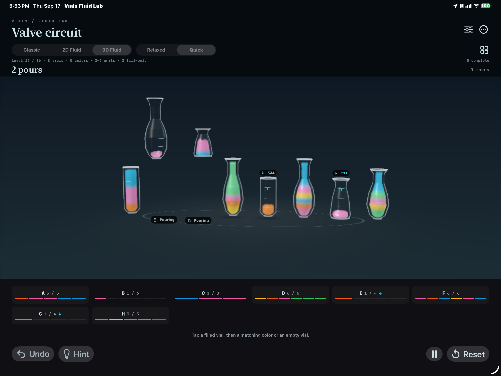
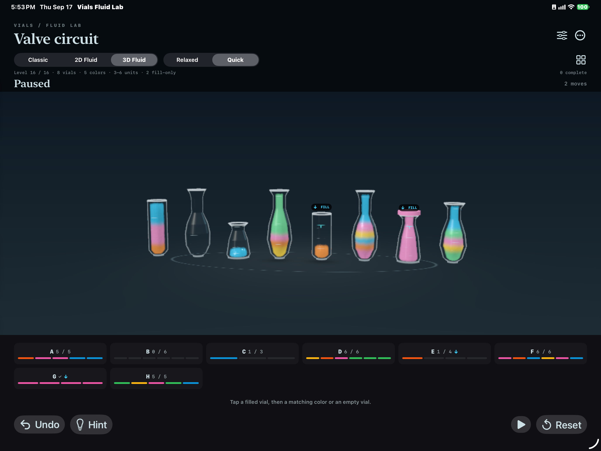

# Physical fill verification and expanded-level profiling

This follow-up closes the three requested checks: verify the reported final-fill/cap behavior on the physical iPad, confirm the completed-cap overlap work, and establish a real-device performance baseline for the expanded puzzles.

## Final-fill transition

The last visible level change came from a small set of correction particles. They were assigned to the destination and moved near the final surface immediately before the canonical 0.55-second settle, so the main body animated correctly but the final few percent could still appear in one frame.

Correction particles are no longer repositioned before settling. Sequential and shared-receiver paths freeze physical integration during the final interpolation, advance their clocks normally, and move every participating particle from its current position to the exact canonical target over the same interval. The Level 16 B+C→G fixture records 21 visible final-settle frames and reaches the exact logical and particle inventory.

A signed Release build was installed on the physical 13-inch M4 iPad Pro. The deterministic replay performed B→G and C→G concurrently twice, then paused. The final frame shows G full, continuous and capped. CoreDevice reports that screen recording is unsupported on this iPad, so the retained evidence is the during-pour and final screenshots plus the deterministic frame-level regression.

## Completion-cap ordering

This was not outstanding implementation work: Prototype23 and commit `7ff55f9` already moved Classic/2D caps into each vial's ordered layer and 3D caps into the glass depth pass, with physical portrait/landscape verification. The stale Prototype19 and handoff references are now explicitly marked resolved.

The current renderer was rechecked with `Scripts/validate_overlap.sh`. All 18 cap-crossing, near-full, crossing, shared-receiver and return-crossing cases across Classic, 2D and 3D reported zero vessel penetration, clipping or spatial clipping.

`Scripts/validate_complexity.sh` also passed from a clean Release build after the settle change: all 16 model solutions, all 175 expanded-level 3D pours, and all 175 corresponding 2D pours completed with no reported errors or vessel penetration. The targeted concurrency suite passed Classic, 2D and 3D independent/shared-receiver cases, including the exact Level 16 replay.

## Physical M4 iPad performance baseline

Configuration:

- iPad Pro 13-inch (M4), iPadOS 27.0, signed Release build
- Sixfold: 10 vials, 6 colors, capacities 3–6
- 3D Fluid, Quick pace, automatic quality, 1000-pixel maximum render dimension
- 22,400 particles; up to four dependency-independent pours and two streams into one receiver
- 90-second active trial followed by an 8.43-second drain

Results:

| Metric | Result |
| --- | ---: |
| Pours | 18/18 committed |
| Maximum concurrent pours | 4 |
| Median controller/draw interval | 98.51 ms |
| p95 controller/draw interval | 144.81 ms |
| Median update/encode/GPU-wait wall time | 95.97 ms |
| Median Metal command-buffer GPU duration | 96.13 ms |
| p95 Metal command-buffer GPU duration | 132.17 ms |
| Thermal state | nominal → nominal |
| Maximum correction | 0.469% |

The matching 61-second Xcode Game Performance Overview trace attached successfully and retained nominal thermal state. Its per-frame layer tables were empty when exported, so it is retained only as corroborating trace/thermal metadata; the app's Metal command-buffer timings are the quantitative frame evidence. These counters are active controller/draw callbacks rather than compositor presents, but their close host/GPU values clearly identify a GPU-bound workload around ten active updates per second at the largest current particle count.

The device was connected over USB and remained at 100% with battery state `full`. That is not energy or battery-life evidence. A future energy comparison must be unplugged, randomized and long enough to move the coarse battery gauge.

Raw measurement: [Sixfold device report](trial-sixfold-fluid-quick-automatic.json). The large `.trace` bundle remains outside Git; [its exported table of contents](game-performance-toc.xml) records the device, target, duration and instruments.

## Next performance target

The expanded level is simulation/GPU bound rather than limited by SwiftUI controls or pour scheduling. The next optimization pass should reduce 3D simulation cost at high unit counts—most likely adaptive particles per unit or a lower-cost background/settled representation—while keeping geometry-correct volume and the visual character that testers prefer. Repeat this exact Sixfold trial after each change; do not infer displayed FPS or battery life from the current counters.
