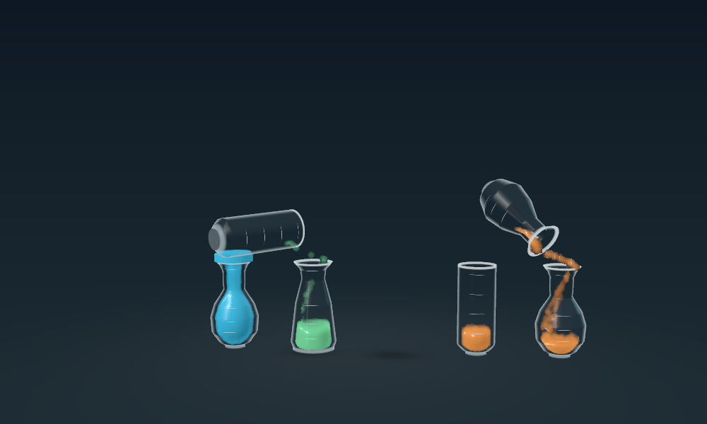
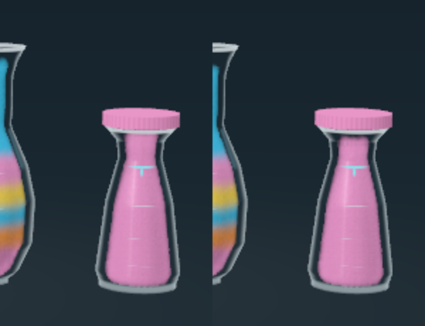
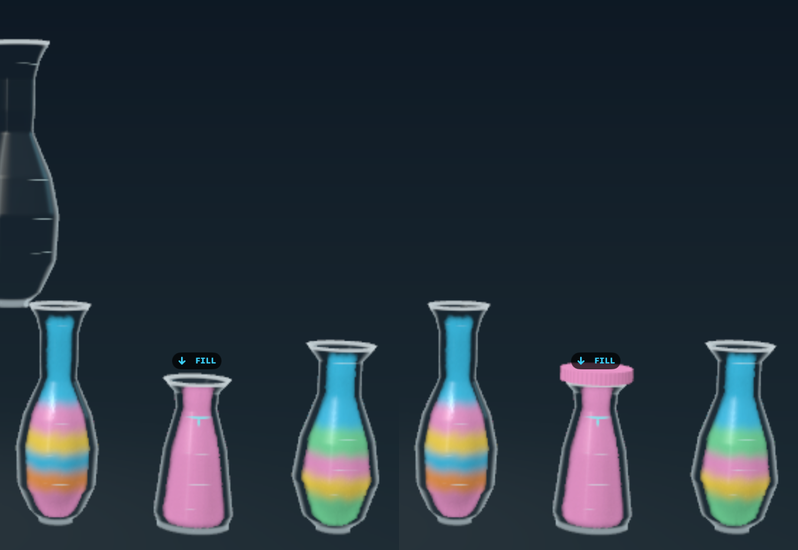
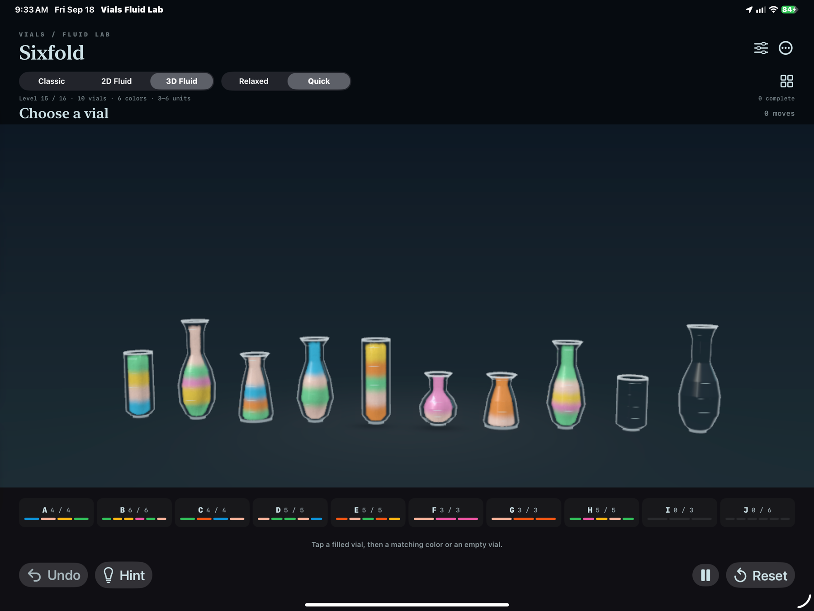
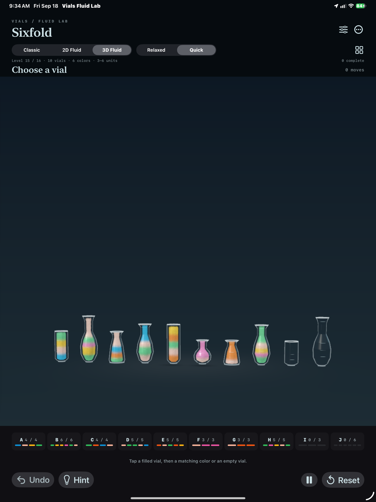
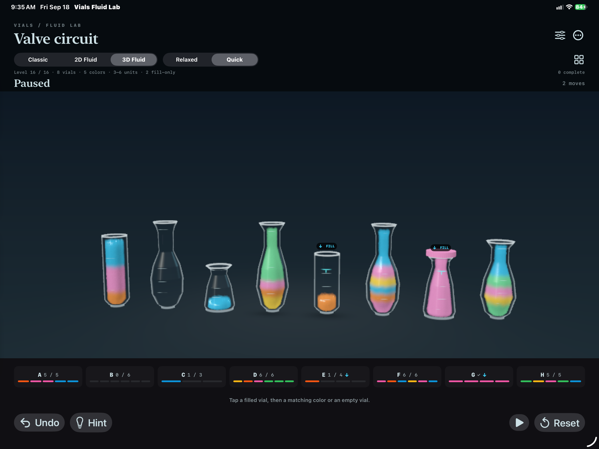

# Matched 3D board scale and a quieter floor

The 3D board camera now derives its framing from the same normalized scale used by Classic and 2D instead of a fixed conservative distance. Resting vials therefore occupy approximately the same visual height in all three presentations across four through ten vials, portrait and landscape. A projection lens shift also keeps their common floor on the same screen baseline as the planar modes without changing the proven lift, pour or return paths.

The large 3D board floor ellipse has been removed. Local contact shadows remain, so vessels still feel grounded without an extra enclosing line. The smaller orientation ellipse in the standalone two-vessel pour study is intentionally retained.

The per-vial information cards now remain in one ordered row instead of wrapping after six entries. Eight-vial boards retain the original type scale; the cards use tighter spacing and slightly smaller type only when the available width requires it. The largest ten-vial board remains fully readable in both iPad orientations, keeping each card directly beneath its corresponding vessel and returning the second-row height to the playfield.

## Physical iPad verification

The signed Release build was installed on the 13-inch M4 iPad Pro. Matching initial Level 16 captures in Classic, 2D and 3D confirm that the three presentations now occupy essentially the same visual envelope. The 3D floor ellipse is absent in landscape and portrait, while local contact shadows remain.

The exact concurrent Level 16 B+C→G replay kept both lifted sources in frame, completed both moves, continuously filled G and showed its pink completion cap. The installed build was then checked on the ten-vial Sixfold board in both orientations. All ten letter/count/capacity cards and their unit-color bars fit in a single row.

A subsequent physical replay exposed one remaining sequencing problem: the canonical final settle ran after B/C had returned, so G visibly rose when its cap appeared. Shared 3D receivers now settle to their canonical, naturally headspaced level while the empty sources remain held above the receiver. Their particles are then frozen while the sources return, and the cap appears only after the motion completes.

The tester's later 15-second iPad recording made a second, purely visual problem reproducible. Frame-by-frame inspection from 11–13 seconds showed that G's particle surface was already stable; the apparent final rise occurred when the opaque pink cap bridged the remaining air gap. The renderer had also placed particle centers at the common fill line even though their billboards extend one rendered radius above those centers. Completed 3D vessels now keep the cap mesh fully outside the cavity, use a dark neutral underside/gasket, and pack particle centers one rendered radius below the common fill line. The resulting visible surface retains the same realistic air gap as Classic and 2D.

The focused regression records 21 held-source settle frames, followed by 34 source-return frames in which every G particle remains position-stable. It now measures the visible particle surface and retains 0.20 scene units of headspace. The comparison below shows the prior matching-cap merge at left and the calibrated headspace at right. The following paired physical-iPad crops document the stable liquid height immediately before and after the old cap treatment and are retained as the source evidence for the follow-up.

## Verification

- `Scripts/validate_scale_parity.sh` passes for 4, 6, 8 and 10 vials at six portrait/landscape aspect ratios. The maximum normalized height difference from the planar reference is 15.1%, and the common-floor baseline differs by less than 0.7% of view height.
- `Scripts/validate_complexity.sh` passes all 16 model solutions and every 3D/2D move in Five Streams, Tall Order, Sixfold and Valve Circuit with the original collision-safe motion geometry.
- `Scripts/validate_overlap.sh` passes all 18 Classic, 2D and 3D cap-crossing, near-full, crossing, shared-receiver and return-crossing cases with zero vessel penetration, clipping or spatial clipping.
- The complete concurrency suite verifies that every 3D completion cap remains above the vessel cavity, measures the visible Level 16 headspace after accounting for particle radius, and retains all simultaneous-pour, reservation, pause, undo and reset coverage.
- The Classic renderer now terminates each live stream at the receiver's accumulated fluid surface, including the combined progress of concurrent pours, rather than at the vial rim.
- macOS Debug and signed iOS Release builds pass after the single-row layout change. The latest cap/surface calibration was rebuilt and visually captured on macOS, and its unsigned generic-iOS Debug build (including the Metal shader) succeeds; physical-device installation remains pending because the iPad was no longer discoverable by CoreDevice at the end of this follow-up.
- The receiver-first settling change passes the complete concurrency suite and every 3D/2D move in the four expanded boards. CoreDevice screen recording remains unsupported on this iPad, so the tester-provided Photos recording, retained screenshots and focused frame regression provide the transition evidence.

The camera regression measures resting board scale. The renderer continues to reserve enough motion space for the existing authored pours rather than compressing or rerouting them solely to keep every lifted tall vial inside an unusually wide diagnostic crop.
