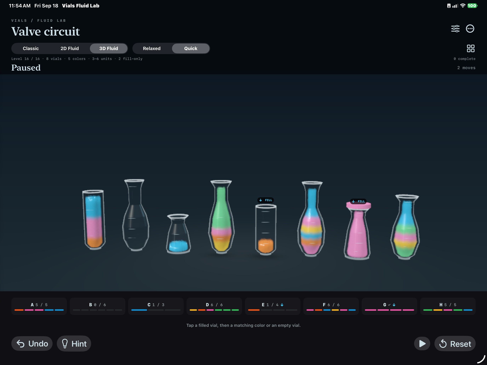
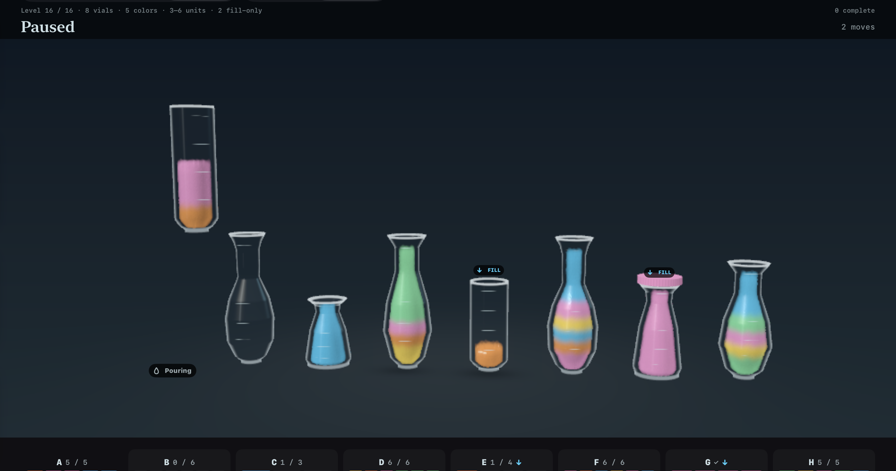
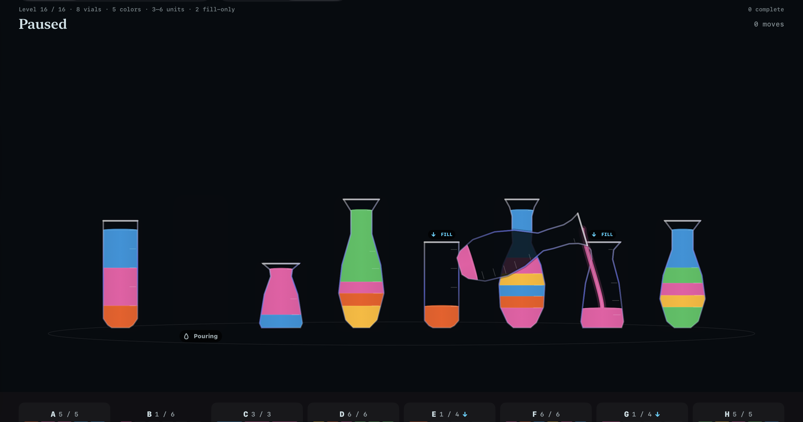
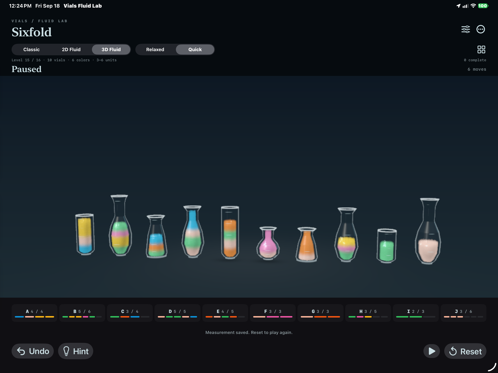

# Physical acceptance and compact 3D simulation lanes

This pass first completed the physical-iPad acceptance checks for the final Level 16 transition fixes, then removed the dominant duplicated simulation work on expanded 3D boards.

## Physical Level 16 acceptance

A signed Release build from the current branch was installed on the 13-inch M4 iPad Pro. CoreDevice screen recording remains unsupported on this device, so two isolated trial launch paths pause the exact reported sequences at useful inspection frames without reading or changing saved play.

- The B+C→G replay ends with G continuously filled, a visible air gap beneath the completed cap, the cap fully outside the cavity, and no redundant cyan in-glass valve glyph. The explicit `↓ FILL` badge remains.
- The A→C replay pauses after final settling while A is returning. All three retained orange/pink units remain inside the raised A glass, while completed C is already stable at home. Nothing waits at A's home position to reappear as the glass descends.
- The Classic replay pauses at the middle of B→G. Its pink stream continues below G's rim and terminates at the accumulating pink surface.

The focused concurrency regression also passes: B+C→G records 21 held-source settle frames, 34 stable-receiver return frames and 0.20 scene units of visible headspace; A→C records 34 return frames with all retained particles inside A and less than 0.001 scene units of source-local drift.

## Compact receiver-lane simulation

The visible 3D board still renders all 640 particles per unit. Previously, however, every independently active receiver lane also allocated and simulated a complete copy of the board. Four concurrent receivers on Sixfold could therefore run the full 22,400-particle pressure solve four times before the board rendered its own composite.

Each receiver lane now keeps only the parcels in its participating source and destination vessels. A later source joining the same receiver adds only its newly owned parcels. The lane's grid, pressure, velocity and constraint passes resize to that compact working set; the main renderer continues to composite and display the complete board with unchanged particle density, shapes, timing and final canonical volumes.

The exact Level 16 B+C→G shared lane now simulates five units, or 3,200 particles, rather than the full 22,400-particle board. The regression asserts this working-set size in addition to all existing move, reservation, pause, undo, cap, headspace and retained-source checks.

## Matched physical-iPad Sixfold trial

Both runs used the same connected M4 iPad Pro, signed Release builds, Sixfold / 3D Fluid / Quick / automatic quality, a 1,000-pixel render limit, four dependency-independent pours, and a 30-second active interval followed by drain. Both committed the same six pours and remained thermally nominal. The iPad was connected/full, so this is performance evidence rather than energy evidence.

| Metric | Before | Compact lanes | Change |
| --- | ---: | ---: | ---: |
| Full visible-board particles | 22,400 | 22,400 | unchanged |
| Maximum active lane particles | up to 89,600 theoretical | 12,160 measured | substantially lower |
| Median Metal GPU time | 43.09 ms | 13.42 ms | -68.9% |
| p95 Metal GPU time | 98.34 ms | 78.02 ms | -20.7% |
| Median controller/GPU-wait wall time | 16.95 ms | 12.84 ms | -24.2% |
| p95 controller/GPU-wait wall time | 102.93 ms | 81.41 ms | -20.9% |
| Median active callback interval | 21.45 ms | 17.82 ms | -16.9% |
| p95 active callback interval | 104.37 ms | 83.34 ms | -20.2% |
| Intervals over 25 ms | 144 | 82 | -43.1% |

The counters are active controller/draw callbacks and Metal command-buffer durations, not compositor-present FPS. Short USB runs also do not establish battery life. The remaining p95 spikes show that the largest view is not yet a locked 60 fps workload, but the dominant duplicated receiver simulation is removed without reducing visible particle count.

Raw matched reports: [before](sixfold-before.json) and [compact lanes](sixfold-after.json).

## Validation

- Signed iOS Release build succeeds and is installed on the physical iPad.
- `Scripts/validate_concurrent.sh` passes Classic, 2D and 3D three-way overlap, shared receiver, dependency, pause/suspend, checkpoint, partial completion, undo and reset coverage.
- The same suite passes the Level 16 headspace and partial-source regressions and asserts the compact 3,200-particle shared lane.
- `Scripts/validate_overlap.sh` passes all 18 cross-mode cap-crossing, near-full, crossing, shared-receiver and return-crossing fixtures with zero penetration or clipping.
- `Scripts/validate_complexity.sh` covers every model solution plus all 175 3D and 175 2D moves in the four expanded boards.

The next performance target is the remaining high-percentile work: full-board surface reconstruction and/or worst-case multi-lane frames. Preserve the current particle density and visual character until a measured alternative proves equivalent on the physical iPad.
