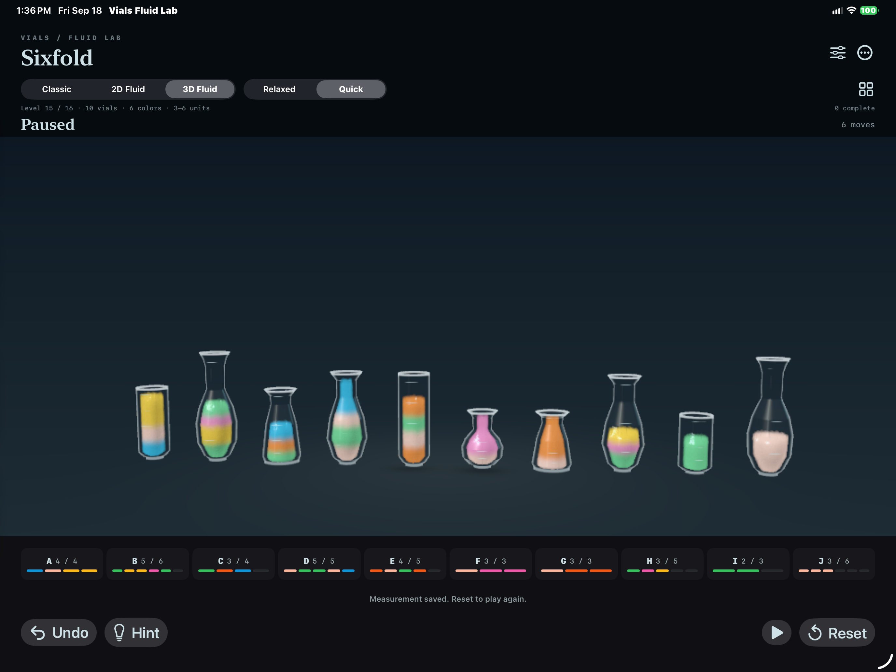

# Multi-lane frame-spike reduction

This pass isolated and reduced the remaining high-percentile cost in expanded 3D boards without lowering the visible particle density.

## Diagnosis

The performance recorder now reports the visible-board render and concurrent receiver-lane physics separately. A matched 30-second Sixfold / Quick / 3D Fluid trial on the physical 13-inch M4 iPad Pro showed that the full 22,400-particle surface was not the source of the 78 ms p95:

- visible-board surface: 1.33 ms median, 2.71 ms p95;
- compact receiver-lane physics: 11.93 ms median, 77.00 ms p95.

The spike was a catch-up feedback loop. After one delayed callback, each independent receiver lane could advance as many as 12 fixed 120 Hz steps. The resulting long GPU command delayed the next callback, which then requested another catch-up burst.

An occupied-grid clearing experiment was also measured. Replacing each 245,760-cell clear with occupied-cell clears produced no meaningful device improvement and slightly worsened callback counts, so that experiment was reverted rather than retained as unproven complexity.

## Retained optimization

Normal Quick motion at 60 Hz needs 3.2 fixed simulation steps per callback, periodically consuming a fourth step. When two or more independent receiver lanes are active, each lane now has a four-step catch-up ceiling. A single lane retains the original 12-step allowance.

Multiple independent receiver groups also use three pressure projections per step, matching the established standalone 3D fluid prototype. One active receiver group retains five projections, including when two sources share that receiver. Particle count, fixed-step rate, authored motion timing, final correction bounds and exact logical state are unchanged.

## Matched physical-iPad result

Both retained comparisons used the same connected M4 iPad Pro, signed Release builds, Sixfold / 3D Fluid / Quick / automatic quality, 1,000-pixel render limit, four dependency-independent pours, and a 30-second active interval followed by drain. Both committed six pours, reached four concurrent pours with two sources sharing a receiver, rendered all 22,400 visible particles, peaked at 12,160 lane particles and remained thermally nominal.

| Metric | Before | Bounded multi-lane work | Change |
| --- | ---: | ---: | ---: |
| Median Metal GPU time | 13.46 ms | 12.23 ms | -9.1% |
| p95 Metal GPU time | 78.18 ms | 22.91 ms | -70.7% |
| Maximum Metal GPU time | 120.43 ms | 30.94 ms | -74.3% |
| p95 lane-physics GPU time | 77.00 ms | 21.77 ms | -71.7% |
| Median callback interval | 17.80 ms | 17.82 ms | effectively unchanged |
| p95 callback interval | 84.62 ms | 25.59 ms | -69.8% |
| Intervals over 25 ms | 77 / 413 | 31 / 530 | 59.7% fewer events |
| p95 controller/GPU-wait time | 80.73 ms | 24.25 ms | -70.0% |
| Final drain time | 4.79 s | 4.86 s | effectively unchanged |

These are controller/draw callback and Metal command-buffer measurements, not compositor-present FPS. The connected/full battery state is performance evidence, not energy evidence.

Raw reports: [before](sixfold-before.json) and [after](sixfold-after.json).

## Validation

- Signed iOS Release build succeeds and the measured build is installed on the physical iPad.
- `Scripts/validate_concurrent.sh` passes the full Classic, 2D and 3D matrix, including three independent pours, shared receivers, dependency guards, pause/suspend, checkpoint, partial completion, undo and reset.
- The focused Level 16 regressions still record 21 held-source settle frames, 34 stable-receiver return frames, 0.20 scene units of headspace and retained partial-source containment.
- `Scripts/validate_complexity.sh` passes all 16 model solutions, all 175 expanded 3D route moves and all 175 expanded 2D route moves.
- `Scripts/validate_overlap.sh` passes all 18 cross-mode fixtures with zero penetration or clipping.

The remaining performance work is no longer the earlier 78 ms catch-up spike. Longer unplugged energy testing and compositor-present measurements remain separate future work.
