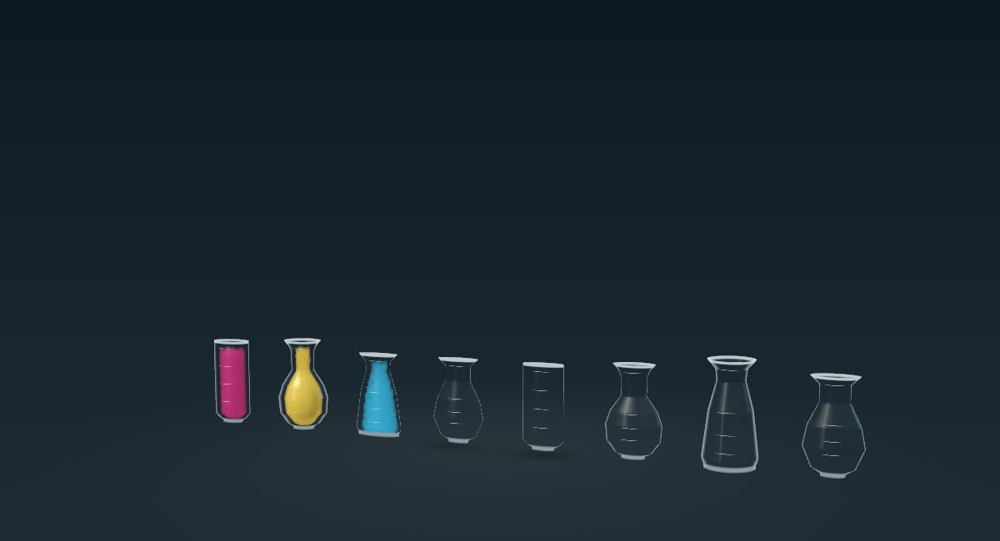
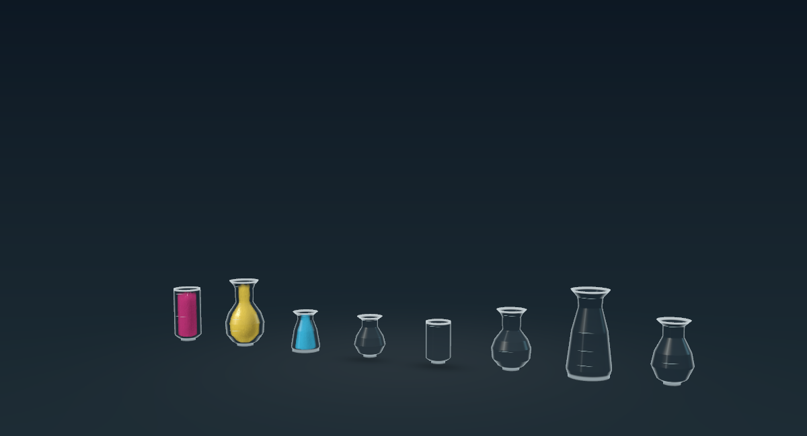

# Round vessels and consistent fill heights

September 19, 2026. This replaces the rejected flattened-vial sizing described in Prototype30's postmortem. The new design is implemented and available for Eddie's visual review; passing tests are not recorded as user acceptance.

## Design

Capacity changes both height and width, with round cross-sections. Relative to a four-unit vial of the same shape:

| Capacity | Height | Width and depth |
| --- | ---: | ---: |
| 1 | 50.0% | 70.7% |
| 2 | 70.7% | 84.1% |
| 3 | 86.6% | 93.1% |
| 4 | 100% | 100% |
| 5 | 111.8% | 105.7% |
| 6 | 122.5% | 110.7% |

These proportions preserve equal interior volume per logical unit without hiding volume differences in depth. Shapes are still normalized to equal capacities, so different flask shapes can have different maximum widths. Four-unit geometry retains its previous dimensions. The camera and motion timing were not changed. The baseline constant-width test was replaced with invariants for roundness, growth, minimum readable proportions, volume and correct graduation counts.

2D now projects the same interior volume-to-height curve used by Classic, cached in a 129-entry lookup so particle constraints avoid repeated binary searches. It retains planar simulation; matching a 3D volume projection intentionally replaces the old equal-screen-area assumption. Equal quantities need not have equal screen areas when vessels have different depth/shape. Glass width is never normalized independently. 3D keeps its existing particle-center inset to allow for reconstructed surface thickness and headspace.

A broad 2D regression caught a 7.63% low surface late in Tall Order after changing the fill projection. Particle separation still assumed constant screen area. Bulk separation now follows the local projected depth (`pi * radius / 2`) and the shared physical unit volume, with bounded spacing; airborne particles retain their existing spacing. This fills broad bodies and narrow necks consistently during simulation rather than repacking successful arrivals at the final correction. All 175 expanded 2D transfers subsequently pass, with maximum fill-height error 3.04% or less; Tall Order itself stays below 0.47%. The same activation/cleanup stability checks remain enabled. See [summary](2d-summary.json) and [initial failure](2d-fill-before.json).

3D graduation marks now represent actual units, from one through six. One-unit vessels no longer display four quarter-capacity marks.

## Removed workaround and inherited failure

The earlier uncommitted flattening implementation changed glass meshes, caps, seeding, collision boundaries and mouth capture. Its capture/guide behavior caused the shared-receiver fixture to restore a source instead of completing. The failure reproduced with the starting geometry/2D source and its collision implementation, before removing that workaround. The new round profiles initially exposed the same failure; changing profiles alone did not fix it.

Restoring the round mesh, seeding and collision/guide implementations removes the special flattened-mouth behavior. The complete concurrent regression and overlap fixtures then pass. The flattening changes are removed as a group; the 5% cleanup acceptance threshold was not increased. The failure evidence is preserved in [inherited-shared-receiver-failure.log](inherited-shared-receiver-failure.log). This establishes the observed regression and successful removal of the workaround, not an attribution to a single individual shader expression.

## Visual comparison

| Rejected flattened geometry | Revised round geometry |
| --- | --- |
|  |  |

[Actual Mac UI](mac-ui.png), [2D](2d-after.png), [Classic](classic-after.png), [portrait 3D](3d-portrait.png), [completed 3D targets](3d-solved.png), and [completed 2D targets](2d-solved.png). Native renderer captures include Mixing level 5, Density level 1 and Sorting Five Streams, in all three presentations, portrait/landscape, with an angled 3D view. Complete Mixing/Density routes capture initial pours, source returns, final targets and caps. The captures are rendered from production views; they are separate from actual app UI automation.

## Validation and limits

The Mac was kept awake with `caffeinate -di`. Actual accessibility UI automation selected Mixing → Measured batch, switched presentations, poured A→D in 3D, paused/resumed during motion, verified the move committed, switched through all three presentations without losing that move, and reset the level. After the packing correction, it also completed a 2D A→D pour, undid it and switched back to 3D. The final Mac app is left open on the revised 3D Measured batch board.

- Model validation passes all 31 catalog levels and all 15 authored experimental routes.
- Session validation passes the 15 experimental levels, apparatus operations, undo, persistence, lab switching and selective Density migration.
- Full Mixing Measured batch and Density Heavy landing routes pass in all three presentations (33 pours plus nine apparatus activations), with projected fill-height checks. [Log](presentation.log).
- Geometry/complexity validation passes all 16 Sorting solutions, variable capacities and valve rules.
- All 175 expanded 2D Sorting pours pass, including activation stability, final surface height, preservation of arrivals during cleanup and idle freezing. These concurrent functional checks are not performance measurements.
- Full concurrency validation passes shared receivers, late joins, three-way independent lanes, pause/suspension, checkpoint, undo, reset and cancellation during worker execution.
- Overlap validation passes all 18 mode/fixture combinations (36 transfers), with no sampled 3D intersections or sampled 2D/3D clipping. Finite sampling is not a proof for every possible trajectory; Classic's geometry counters remain placeholders.
- macOS Release and signed iOS Release builds pass. Physical iPad installation and checks remain pending availability; no claim of iPad performance or battery improvement is made.

The revised profiles also completed the four expanded 3D routes (175 pours) without rejected transfers or sampled vessel penetration. Five Streams and Tall Order were run before removing the flattening collision code; Sixfold and Valve Circuit ran with the restored round collision shader. The final-round collision implementation is additionally covered by the complete concurrency, overlap and small-capacity presentation suites above.

The pre-existing Density starting-board corrections, routes, migration and horizontal apparatus badges were retained. Their changes remain independently reviewable in the working tree. No commit or push was requested for this recovery.

## Reproduction

```sh
bash Scripts/validate_vessel_presentation.sh path/to/default.metallib build/vessel-presentation
bash Scripts/validate_concurrent.sh path/to/default.metallib build/vessel-concurrent
bash Scripts/validate_overlap.sh path/to/default.metallib build/vessel-overlap
bash Scripts/validate_complexity.sh build/vessel-complexity
zsh Scripts/validate_keystone_session.sh
```

Large builds and intermediate captures are under ignored `build/round-vials`. That folder also preserves the full working-tree patch from before this task. The historical postmortem remains unchanged.
