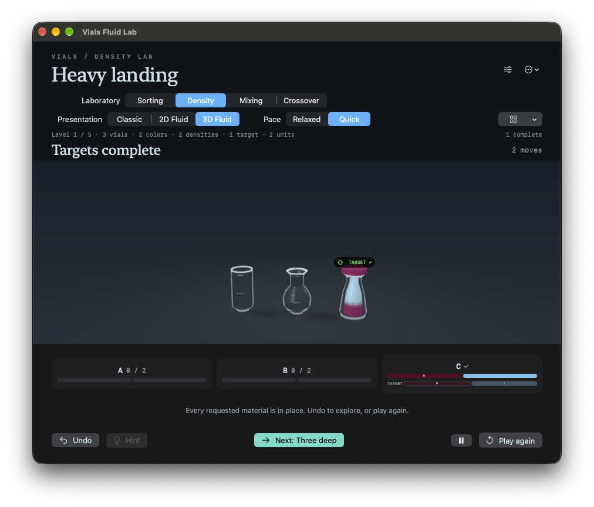

# Stable Next Level placement

The Next Level button now sits below the information text, between Hint and Pause in the bottom toolbar. This is the shared board UI used by Sorting, Density, Mixing and Crossover in Classic, 2D Fluid and 3D Fluid.

The toolbar reserves the button's space before completion and has a stable minimum height. While unsolved, the button is invisible, disabled, excluded from hit testing and hidden from accessibility. Completing a level no longer inserts a separate row above the information text.

Actual Mac UI automation reset and solved Density / Heavy landing in each presentation, measuring the vial, status-card, information and control positions before/after completion. Every measured vertical position remained unchanged. The visible Next button was below the information text and between Hint and Pause. Clicking it opened Three deep; the unsolved board hid it from accessibility. The app was returned to solved Heavy landing for review. `caffeinate -di` was active throughout.

```text
Classic: PASS; vial/cards/info/controls Y unchanged: 692/862/942/988; Next below info and between Hint/Pause.
2D Fluid: PASS; vial/cards/info/controls Y unchanged: 692/862/942/988; Next below info and between Hint/Pause.
3D Fluid: PASS; vial/cards/info/controls Y unchanged: 697/862/942/988; Next below info and between Hint/Pause.
```

macOS Release and signed iOS Release builds pass. No physical iPad installation/check was performed for this layout edit.


