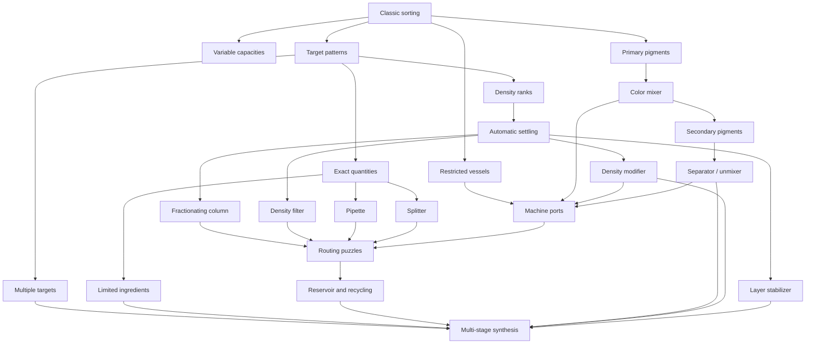

# Fluid Logic Laboratory: Puzzle Vocabulary And Campaign Design

Date: 2026-09-18
Status: Design exploration; not yet an implementation commitment

## Purpose

Capture a possible long-term direction for Vials Fluid Lab beyond traditional liquid sorting. The existing sorting game remains a complete, approachable mode. A broader campaign can gradually evolve the same verbs into a fluid-logic laboratory in which the player receives ingredients and uses vessels and tools to manufacture one or more requested results.

The intended progression resembles the teaching structure of *Portal 2*: introduce a mechanic in isolation, let the player practice it, reveal a twist, combine it with one familiar mechanic, and only later ask the player to use a larger vocabulary freely.

The working north star is:

> Use vessels and laboratory tools to transform a limited set of fluids into a specified target arrangement.

This direction is deliberately broader than "add density" or "add color mixing." Density, pigment, volume, miscibility, vessels, and machinery become independent but compatible parts of a readable puzzle language.

## Product Shape

The game can support two related experiences:

1. **Classic sorting:** The current objective of collecting colors into completed vials. It remains simple, relaxing, and replayable.
2. **Laboratory campaign:** Authored puzzles about reproducing patterns, synthesizing colors, separating components, modifying density, managing quantities, and operating equipment.

Classic, 2D Fluid, and 3D Fluid should remain presentation modes rather than different rule sets. Density or chemistry would be a puzzle rule set available through those presentations, not a fourth rendering mode.

## Design Principles

### Teach a language, not a list of exceptions

Every mechanic should behave consistently enough that the player can use it as a reusable verb. A mixer always mixes by the same recipe rules. A density modifier always moves material one density step. A filter never makes an unexplained exception for a particular level.

### Make every result observable

The player should be able to identify color, quantity, density, and important machine state before acting. No puzzle should depend upon remembering invisible material properties.

A possible explicit exception is the optional **Obscured Fluids** experiment below. Unknown material must be clearly marked, discovery rules taught, and discovered information retained. It should not make ordinary laboratory puzzles conceal essential state.

### Keep outcomes deterministic

The same state and action must always produce the same result. Determinism is essential for Undo, hints, solution verification, authored difficulty, save restoration, and trustworthy animation.

### Preserve matter unless a rule says otherwise

Mixing, splitting, and separation should conserve volume. A drain, evaporation tool, or reaction may remove material, but that loss must be an explicit part of the rule and presentation.

### Add a new decision, not merely more steps

A candidate mechanic should survive five questions:

1. Can its rule be explained in one sentence?
2. Can its state be recognized without opening an information panel?
3. Does it produce a genuinely new decision?
4. Can the solver represent it deterministically?
5. Can it combine meaningfully with at least two older mechanics?

### Retain the relaxed character

Concurrency should remain a convenience and expressive animation feature rather than a timing requirement. Machines may create sequencing problems, but the main campaign should not become an action game.

## Goal Evolution

The most important transition is not density or mixing. It is teaching a new definition of success.

Early levels ask the player to sort every fluid into monochrome vials. Laboratory levels can instead show a target rack or recipe card and ask the player to:

- Reproduce a pictured order of colored layers.
- Reproduce both color and density order.
- Produce an exact quantity of a requested material.
- Fill several target vials from limited ingredients.
- Preserve or dispose of specified byproducts.
- Complete the targets within optional move or apparatus-use goals.

Target patterns should therefore be introduced before density or mixing. The player first learns the new objective language using familiar fluids. Every later mechanic then has an obvious purpose.

## Fluid Model

Color and density should be independent properties rather than encoding density as a different color identity.

Conceptually:

```text
Fluid portion
|- pigment: blue
|- density: light
|- quantity: 2 units
`- miscibility group: pigment
```

Potential later properties such as viscosity, temperature, or phase should not be added until the initial property model has demonstrated sufficient depth.

### Initial density rule

- Use three ranks: light, medium, and heavy.
- Fluids are initially immiscible.
- After a legal pour, the destination settles into a deterministic density order.
- Heavy fluid settles below medium fluid; medium settles below light fluid.
- Equal-density ordering uses a documented, stable rule rather than physics randomness.
- The authoritative model settles immediately; each renderer animates toward that known result.

Unrestricted pours into any non-full vial are the clearest initial rule, but that freedom must be tested. It may make puzzles too easy. Solver statistics and authored prototypes should determine whether color matching or another destination constraint is necessary.

### Initial color-mixing rule

Use a small stylized recipe set rather than attempting realistic color science:

- Red + yellow -> orange
- Yellow + blue -> green
- Blue + red -> purple

A promising first rule is:

- Mixing requires equal-density ingredients.
- Volume is conserved.
- The result retains that density.
- Only explicitly taught pairs mix.
- Undefined combinations remain separate or are rejected; they never produce an unexplained muddy color.

This keeps pigment and density understandable as independent axes.

### Separation rule

An unmixer should not function as a universal Undo. It can remain interesting by requiring:

- A recognized secondary pigment.
- Two available output vessels or machine ports.
- Sufficient output capacity.
- Possibly a limited charge in advanced puzzles.

One unit of a secondary material separates into its known components according to the same conserved-volume convention used by the mixer. The exact unit convention must be settled before implementation so mixing and unmixing cannot create or destroy useful volume.

## Candidate Puzzle Vocabulary

### Foundation and goals

| # | Element | What it adds |
|---:|---|---|
| 1 | Grouped pouring | The existing core verb |
| 2 | Variable capacities | Space planning |
| 3 | Fill-only and source-only vessels | Directional commitment |
| 4 | Target pattern card | Reproduce a pictured layer arrangement |
| 5 | Exact-volume target | Produce a precise quantity |
| 6 | Multiple target vials | Coordinate several outputs |
| 7 | Limited ingredients | Conservation and planning |
| 8 | Byproduct requirements | Preserve, recover, or dispose of leftovers |

### Material behavior

| # | Element | What it adds |
|---:|---|---|
| 9 | Three density ranks | Light, medium, and heavy material |
| 10 | Automatic density settling | Layers reorder after a pour |
| 11 | Miscibility groups | Determines what blends and what stays layered |
| 12 | Primary pigments | Red, yellow, and blue ingredients |
| 13 | Secondary pigments | Orange, green, and purple products |
| 14 | Deterministic recipes | Known, previewable transformations |
| 15 | Contaminant or neutral fluid | Material that must be removed or worked around |

### Laboratory tools

| # | Element | Operation |
|---:|---|---|
| 16 | Mixer | Combines compatible pigments |
| 17 | Separator or unmixer | Reverses a known secondary pigment into components |
| 18 | Density modifier | Moves fluid one density step lighter or heavier |
| 19 | Fractionating column | Sends density bands into separate outputs |
| 20 | Pipette | Transfers exactly one unit |
| 21 | Splitter | Divides a volume between two destinations |
| 22 | Property filter | Passes a chosen density; color filtering could come later |
| 23 | Stabilizer | Temporarily locks an otherwise unstable layer order |
| 24 | Reservoir | Provides storage but cannot satisfy a final target |
| 25 | Drain or recycler | Removes or recovers an unwanted byproduct |

Fixed inputs, outputs, valves, and conduits form the topology connecting these tools rather than introducing additional material properties.

## Tool Notes

### Mixer

The mixer is the primary constructive tool. It accepts clearly identified inputs and displays the expected output recipe before activation. Early mixers should accept one pair at a time. Later variants may have fixed input ports, limited charges, or output-capacity constraints.

### Separator

The separator provides controlled reversibility. Its puzzle cost comes from requiring output space and managing two resulting streams. It should recognize only recipes the player has already learned.

### Density modifier

The density modifier changes one property without changing pigment:

```text
light <-> medium <-> heavy
```

Early versions can provide separate lighten and densify machines. A later bidirectional tool could be more compact but is harder to read at a glance.

### Fractionating column

This tool separates a vial by density rather than by pigment. It is meaningfully different from the unmixer: the separator reverses a color recipe, while the fractionating column routes existing density bands.

### Pipette and splitter

These provide exact-quantity control. The pipette moves one unit. A splitter divides a known amount using a fixed, visible ratio. Their purpose is measurement, not color or density transformation.

### Filter

The initial filter should pass one density class. A later color filter is possible, but adding both simultaneously would weaken the tool's visual identity.

### Stabilizer

A stabilizer permits a target pattern that gravity would normally rearrange. The resulting locked state must be visually explicit. Whether the lock is permanent, lasts a fixed number of operations, or can be released is an open design decision.

### Reservoir and recycler

A reservoir solves temporary storage problems without counting as a completed target. A drain permits intentional loss; a recycler instead recovers material at an operational cost. The recycler better supports a calm, conservation-oriented tone, while a limited drain may create sharper puzzles.

## Dependency Map



Density and color mixing deliberately develop as mostly independent branches. Each can support a complete chapter before the campaign asks the player to reason about both at once.

## Proposed Campaign

An approximately 80-puzzle authored campaign could use the following broad structure. Counts are planning targets, not commitments.

### Chapter 1: Bench Basics

Approximately 12 puzzles.

Use existing sorting rules, variable capacities, varied vessel shapes, and directional restrictions. This preserves the recognizable opening and gives the current work a permanent home.

Capstone: a larger sorting puzzle combining capacity differences and restricted vessels.

### Chapter 2: Blueprints

Approximately 8 puzzles.

Introduce new goals without introducing new fluid behavior:

- Reproduce one layered target vial.
- Reproduce two target vials.
- Produce exact quantities.
- Preserve an unused ingredient.

This changes the player's mindset from sorting everything to manufacturing what was requested.

### Chapter 3: Strata

Approximately 10 puzzles.

1. Two density ranks.
2. Automatic settling.
3. Three density ranks.
4. The same pigment at different densities.
5. Multiple patterned targets.
6. A density filter or fractionating column.

Capstone: produce two vials with apparently opposing color patterns by manipulating density rather than simply rearranging colors.

### Chapter 4: Chromatics

Approximately 10 puzzles.

Introduce color synthesis without density complications:

1. Red plus yellow makes orange.
2. Yellow plus blue makes green.
3. Blue plus red makes purple.
4. Exact mixture quantities.
5. Multiple secondary-color targets.
6. Limited primary supplies.

Capstone: produce all three secondary pigments from constrained primary ingredients.

### Chapter 5: Recovery

Approximately 8 puzzles.

Introduce separation and byproduct planning:

- Recover a needed primary from a secondary pigment.
- Separate something that was mixed too early.
- Allocate separator outputs into limited vessels.
- Preserve an otherwise unwanted output for another target.

Separation remains powerful but has a spatial or resource cost.

### Chapter 6: Instruments

Approximately 12 puzzles.

Introduce one apparatus at a time:

- Pipette.
- Splitter.
- Density modifier.
- Fractionating column.
- Filter.
- Reservoir.
- Drain or recycler.

Each tool receives a demonstration, practice puzzle, twist, and combination with one familiar idea before it joins the general vocabulary.

### Chapter 7: Cross-Reactions

Approximately 10 puzzles.

Density and color finally interact:

- Mix pigments that have matching densities.
- Change density so two ingredients can be mixed.
- Create a secondary pigment and make it heavy enough for a target's bottom layer.
- Separate a mixture and give the recovered components different densities.
- Stabilize a pattern that would normally settle into another order.

This chapter should feel like the moment the collection of puzzles becomes a chemistry set.

### Chapter 8: Synthesis

Approximately 10 puzzles.

Use the full laboratory vocabulary:

- Multiple target vials.
- Limited ingredients.
- Several interconnected machines.
- Required byproducts.
- Optional efficiency targets.
- More than one valid solution.

The finale could present a large but readable bench requiring three or four products and most of the learned tool set.

## Teaching Cadence

Every substantial mechanic should receive at least four puzzle roles:

1. **Demonstration:** The obvious action works.
2. **Practice:** The player repeats it with one complication.
3. **Twist:** The obvious action now creates a problem.
4. **Combination:** The mechanic is paired with one previously mastered idea.

Only after these stages should it appear without announcement in a larger synthesis puzzle.

A practical level-set rhythm is:

```text
Introduce -> reinforce -> twist -> combine -> breather -> examination
```

Most individual puzzles should feature no more than one unfamiliar concept. A chapter examination can combine several familiar concepts, but should not introduce another rule at the same time.

## Visual Language

### Separate pigment from density

Hue communicates pigment. Density receives several redundant indicators:

- **Brightness:** Heavy variants trend darker; light variants trend pastel.
- **Motion:** Heavy fluid moves sluggishly; light fluid feels lively.
- **Texture:** Light material may have small rising bubbles; heavy material may contain suspended flecks or sediment.
- **Surface:** Meniscus or surface response may subtly vary by density.
- **Glyph:** A small, definitive density symbol appears in the vial information card and target pattern.

Brightness alone is insufficient because it can conflict with pigment recognition, accessibility, and the dark board background. Players should be able to identify density through value, behavior, texture, and a symbol.

### Show recipes on the machine

The player should not memorize an arbitrary hidden chemistry table. A mixer can show a compact preview such as:

```text
red + yellow -> orange
```

The first teaching puzzle should make each recipe unavoidable and visible. Later puzzles may omit tutorial prose, but the apparatus should still preview a valid transformation.

### Animate the authoritative result

The logical model determines the final state first. Classic and 2D can interpolate layer movement directly. The 3D presentation should use guided particle behavior or target interpolation to reach the same state rather than depending on emergent buoyancy to discover the answer. This protects determinism, avoids late visual "poofs," and limits new performance risk.

## Concurrency And Machines

Independent operations may animate concurrently when they do not contend for the same vessel or machine. A destination that is still settling should remain reserved until its authoritative result is visually established.

For shared destinations or multi-input machines:

- Inputs are accepted in a deterministic order.
- Capacity is reserved before animation begins.
- The combined output is calculated before presentation.
- Hints and Undo operate on logical operations rather than animation completion timing.

Concurrency should improve pace but should not change the solution to a puzzle.

## Solver And Save Requirements

Density and chemistry are model features first. Rendering work should not begin until model transitions are canonical and testable.

The model and solver will eventually need to represent:

- Pigment identity.
- Density rank.
- Miscibility group.
- Quantity.
- Vessel capacity and directional rule.
- Machine contents, charges, and port occupancy.
- Target recipes and target layer sequences.
- Deterministic post-operation normalization.

These properties must participate in state equality, canonical solver keys, Undo history, hint generation, trial replay, and save migration.

For density, a canonical transition is:

1. Validate and apply the pour.
2. Combine compatible adjacent portions according to the current miscibility rule.
3. Stable-sort the affected material from heaviest at the bottom to lightest at the top.
4. Merge equivalent neighboring portions.
5. Store the normalized result.

Machine transformations follow the same principle: validate inputs, compute an exact output state, then animate it.

## Keystone Prototypes

Before implementing the full system, design and test three representative puzzles on paper and in the solver model.

### Prototype A: Density only

Reproduce two layered target patterns using three density ranks and no machines.

Questions answered:

- Is automatic settling understandable?
- Are unrestricted destinations interesting or trivial?
- Can players distinguish density reliably?
- Does a target pattern provide a satisfying goal?

### Prototype B: Mixing only

Create orange, green, and purple targets from limited primary pigments.

Questions answered:

- Is the recipe language immediately understandable?
- Is conserved volume intuitive?
- Does exact-quantity planning create worthwhile decisions?
- How much empty apparatus space is needed to avoid frustration?

### Prototype C: First crossover

Create a secondary pigment, modify its density, and place it into a specified target layer.

Questions answered:

- Do pigment and density remain mentally separable?
- Does the combination create insight or only extra chores?
- Is the required operation order discoverable?
- Can the final state be previewed clearly?

If the crossover puzzle feels like busywork, revise the transformations before building a larger machine framework.

## Suggested Implementation Sequence

1. Add target-pattern goals using existing fluids and vessels.
2. Prototype density in the model and solver with a small authored level set.
3. Validate the target and density visual language in Classic and 2D.
4. Add a guided 3D representation and verify it on physical iPad hardware.
5. Prototype the pigment recipe model independently of density.
6. Add the mixer with three primary-to-secondary recipes.
7. Add exact quantities and the pipette only if ordinary grouped pouring cannot support good mixture puzzles.
8. Add the separator after mixing levels prove enjoyable.
9. Prototype the density modifier and the first crossover puzzle.
10. Expand into routing equipment only after the core transformations survive player testing.

This sequence deliberately delays an elaborate laboratory interface. The game should first prove that the underlying transformations produce good puzzles.

## Open Decisions

- Does a density puzzle allow any pour into any non-full vial, or retain a matching-property constraint?
- Is the default laboratory completion condition an exact target pattern, a material recipe, or both depending on level?
- How is volume divided by mixing and unmixing while preserving matter and useful unit sizes?
- Can different-density versions of the same pigment merge after a density change?
- Does a stabilizer lock an entire vial or selected fluid portions?
- Are machine uses unlimited, charge-limited, or scored only as optional mastery?
- Is unwanted material drained, recycled, or required as a target byproduct?
- How much information appears on the one-row vial cards without reducing board clarity?
- At what point does fixed machine topology become more interesting than freely moving vials?

## Future Experiment: Obscured Fluids

**Implementation update (September 20 overnight):** Eddie subsequently authorized the Sorting-only Discovery prototype along with machine guidance and Recovery. Four Discovery and four Recovery levels are now implemented locally; see Prototype37/README.md for behavior, validation and limits. The design discussion below records the broader intent; Density/Mixing/Crossover discovery variants and a campaign unlock tree remain proposals.

Added September 20, 2026, following Eddie's three reference screenshots. Design candidate only; this is not an instruction to implement it or to copy the reference game's visual style, economy, or progression.

### Core idea

Some fluid portions begin unidentified. Their quantity and occupied space remain visible, but their pigment is concealed until the player exposes them by pouring away the known material above. Discovery becomes another reason to make a move.

The references show question-marked lower portions with visible material above, and later states with additional colors exposed. They illustrate the concept; the exact reveal, Undo and scoring rules of that game have not been established.

This is an information mechanic, not another fluid property. The actual material is fixed when the puzzle is created. It must never change to help or punish the player's choices.

### Recommended first prototype: Sorting discovery

- A small optional set of authored Sorting puzzles, starting with one obscured portion and ample empty storage. Keep all materials at the same density.
- Keep capacities, fill heights, unit quantities, empty space and already known material clear. Mask material identity, not how much liquid exists.
- Begin with the top unit identified. Reveal the next portion when it becomes exposed as a pour drains the source. Once identified, it stays identified even if covered again or transferred elsewhere.
- Do not let a grouped pour silently consume an unidentified portion just because the engine knows that its color matches. For the first prototype, stop at the boundary of the known batch; reveal the newly exposed portion, then let the next player action use it. This deliberately introduces a discovery boundary into grouped pouring and needs a pace check.
- Make the reveal a short, pause-aware transition from a neutral unknown appearance to the true pigment. Match reveal timing across Classic, 2D and 3D; provisional animation frames must not leak the next identity early.
- Retain discovered identities through Undo, Reset and save/relaunch for that puzzle. Undo restores the liquid arrangement; it cannot realistically undo the player's knowledge. Clearly distinguish a new puzzle from retrying the same fixed puzzle.
- Keep Undo freely available. Do not add charges, timers, paid reveals or blind irreversible choices to this first experiment.

Suggested teaching sequence: uncover one hidden unit; choose which of two vials to investigate; use a discovered color to free space; combine discovery with a familiar capacity constraint. Test four to six short puzzles before expanding the mechanic.

### Applicability beyond Sorting

| Lab | Possible version | Main concern |
| --- | --- | --- |
| Sorting | Unknown lower pigments; uncover and regroup them | Best first experiment. Avoid mandatory guessing into dead ends. |
| Density | Hide pigment while keeping the Light/Medium/Heavy arrows and quantity visible | Settling can bury or expose portions without pouring them out. Define exposure consistently and retain knowledge by portion identity. |
| Mixing | Unidentified ingredients must be exposed or inspected before entering a mixer | Concealed input identities can turn recipe planning into blind trial and error; introduce an identification tool before this variant. |
| Crossover | Known recipes and density rules applied to partially identified ingredients | Combine only after discovery and identification have proved readable separately. |

Do not hide both pigment and density in the initial Density variant. Keep targets fully visible in every first prototype: uncertainty should concern the ingredients, not what success means. A later scanner or sampling station could identify an ingredient at a spatial or move cost, giving the laboratory a deliberate investigation tool.

### Visual direction for our presentations

- **Classic:** a neutral filled region with a restrained unknown symbol, following the actual vial shape and preserving unit-height cues.
- **2D:** use the same unknown-region language over the fluid surface. Neutralize pigment-specific particles, glows, ribbons and bubbles in unidentified portions so they cannot give away the material.
- **3D:** prototype a neutral opaque treatment on the obscured fluid region, keeping the glass rim and outline readable. Merely frosting the glass or reducing opacity could still reveal the hidden pigment through tint, refraction or reflections. Keep concealed portions clearly distinct from empty glass and from known plain Medium fluid.

Use one shared unknown-material symbol in the fluid, contents strip and spoken descriptions. It must remain distinct from the existing density triangles, selection outlines and completed-vial caps. Known portions retain today's pigment and density treatment.

### Fairness, hints and implementation implications

The full board and the player's knowledge are separate state. Stable parcel IDs are a useful starting point, but material changes and any future split/merge operation need explicit rules for which knowledge carries forward.

A full-information solver finding a solution is insufficient: that solution may require choosing correctly between indistinguishable hidden states. For small authored puzzles, examine the possible states consistent with the player's observations and ensure there is a safe discovery strategy, or an easily recoverable branch with free Undo. Avoid optional minimum-move medals that quietly assume advance knowledge of the hidden arrangement.

Player hints must respect current knowledge. They may recommend a legal exploratory move, but must not silently reveal hidden colors through a prescient move choice. If a future hint explicitly reveals a portion, present that as a taught reveal action. Developer validation may still inspect the full fixed board.

Review every information channel: material labels, contents strips, VoiceOver, destination highlights, target-mismatch explanations, recipe previews, pour previews, particle effects, completion caps and saved examples. The new detailed target feedback must not expose an unknown ingredient's pigment or density prematurely. Developer-only diagnostics may retain full information, but must remain clearly separate from player hints.

This will require model/knowledge state, reveal events, knowledge-aware hints, persistence, Undo policy and renderer masking. It is not safely implemented as a visual overlay alone. Existing concurrent Sorting pours should apply reveal events to their own participating portions in deterministic order.

### Questions for the prototype

1. Does uncovering a color create an enjoyable planning decision, or mainly add repetitive pours?
2. Is the known-batch stopping rule understandable and compatible with the accepted pace?
3. Can players distinguish unknown liquid, known Medium liquid and empty space instantly?
4. Does retaining discoveries through Undo/Reset make retries pleasant without turning every puzzle into a memorization chore?
5. Can all three renderers conceal identity consistently without making the 3D fluid look muddy or unreadable?

Prefer an optional Sorting discovery set first. Revisit Density and an identification apparatus only after that set earns positive feedback.

## Reserve Shelf

The following ideas may support future expansions, but should remain outside the first complete laboratory campaign:

- Viscosity.
- Temperature.
- Freezing and phase changes.
- Acidity and neutralization.
- Catalysts.
- Evaporation.
- Foam and temporary expansion.
- Pressure.
- Rotating gravity.
- Timed reactions.
- Simultaneous real-time machine operation.

Color, density, quantity, and miscibility already create a large combinatorial space. New properties should be introduced only when they provide a distinct cognitive verb rather than a new skin for an existing restriction.

## Related Design Notes

- `Reports/keystone-lab-prototype-plan.md` turns the three recommended keystones into an approved, macOS-first implementation and validation plan.
- `Reports/3d-fluid-simulation-plan.md` is the parent rendering and simulation plan with which these laboratory mechanics must remain consistent.
- `Reports/puzzle-elements-and-fluid-interactions.md` contains the earlier, broader interaction brainstorm.
- `Reports/progression-curriculum-and-valve-plan.md` contains prior progression, scoring, and receive-only-vessel planning.
- `Reports/real-fluid-physics-roadmap.md` covers the rendering and simulation direction separately from this puzzle-rule proposal.


September 21 implementation update: ordinary pours now overlap across all six labs in all three presentations, including shared receivers. Density layer order follows reservations and Discovery reveals are independent per source. Machine activations remain globally serialized with pours/reveals for this first pass. See Prototype38; independent machine operation is still future work.


## Implemented: shapes identify tool roles (September 21, Prototype39)

Traditional test tubes now identify ordinary sources/storage and final targets across all labs. Mixer and separator/Recovery working ports use the existing round bulb flask. Density-changing chambers use the existing flat-bottomed tapered flask. The pear silhouette remains available for a future experiment, without assigning it a mechanic yet. Final target role wins over tools; density wins over another tool on a shared non-target chamber. Shared-role badges supplement shape. Shapes never change when contents, density or completion change. Existing capacity scaling, profile knots and camera/layout policy are preserved. See Prototype39 for regression and device evidence.
